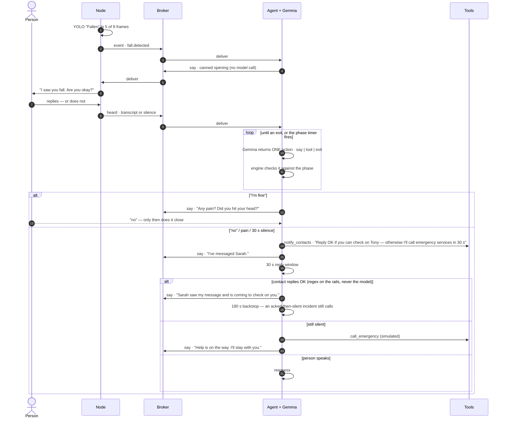
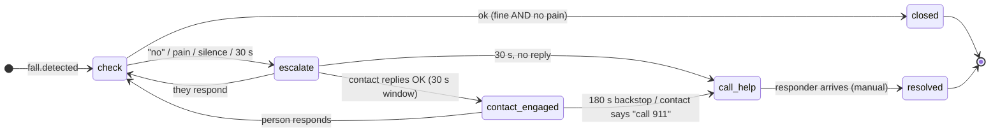
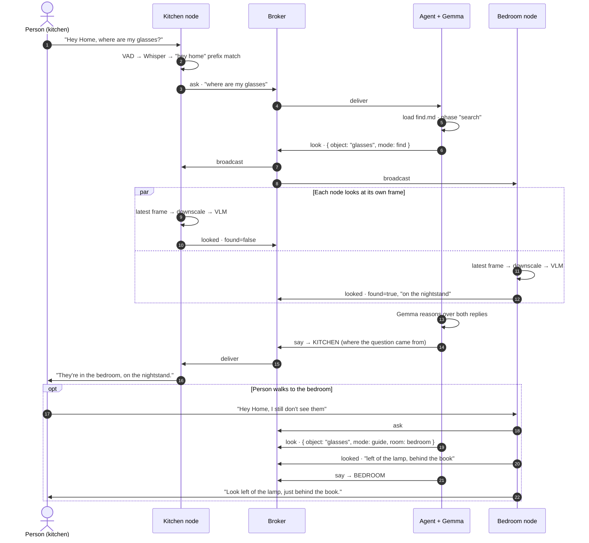

# QNet Home — Design

**QNet Home** is a privacy-first home system built on one event fabric, with capabilities added as pluggable skills. Two use cases are specified here: **fall detection and response** (§3–§9, plus a first-responder brief in §12) and **"where's my stuff"** (§13). They share the same nodes, broker, agent, skill format and dashboard — the second one exists partly to prove that.

*v0.5 — 2026-08-06, the as-built revision: the system described here now exists and has been run end-to-end (`verify/E2E-no-speech.txt`), so most of v0.4's `[?]` tags are `[M]` with the number inline. Where reality diverged from the plan, the section says what was built instead and why — the biggest three: the node VLM runs under Qualcomm's LLM/VLM container rather than GenieX (§13), the voice node became an in-repo Arduino App Lab app rather than a teammate's HTTP service (§9), and the broker lives on non-standard ports by explicit decision (§4). Every measured number's method lives in `measurements.md`; every verification and decision record in `verify/`. §15 is the build order as executed; §17 is what was deliberately left out and how to add it later. The 2026-08-06/07 field round is folded in in place: §8's as-built engine note (plus the flagged IM SDK experiment), §9's measured voice loop (the bench, its two fixes, garble handling), §2/§5's I/O and recovery truths.*

---

## 1. What it does

A room node watches for a fall and publishes an event — never video, never audio. An agent on the IQ-9075 picks it up, opens the offline emergency skill, and works through it: asks if the person is OK, listens, responds. "I'm fine" closes it — after one double-check for pain. Silence or "no" escalates — reassurance out loud, contacts notified, emergency call if there's still no answer — narrating each step so the person is never left in silence.

The second capability is the calm inverse. Someone says *"Hey Home, where are my glasses?"* — every room looks at its own current frame, answers in words, and the house replies out loud in the room the question was asked in.

Everything runs on-device. No frame and no audio clip ever leaves the room it was captured in; the only thing leaving the house is a message to a caregiver.

**The principle:** the agent runs the conversation; the engine guarantees the things that must not fail.

---

## 2. Devices

| Device | Role | Runs |
|---|---|---|
| Arduino Ventuno Q ×2 | Room node | Fall detection · VLM (Qwen3-VL-4B, Qualcomm LLM/VLM container) · voice app (App Lab) · camera preview |
| | | *Fall response uses **one** node (kitchen — the bedroom board deliberately runs no vision, `verify/D2-bedroom-node.txt`). "Where's my stuff" uses both.* |
| IQ-9075 | Brain | Mosquitto · agent · Gemma 4 E2B via GenieX · skills · tools |
| Dell Snapdragon X Elite laptop | Dashboard | Web UI; also the required Windows `.EXE`/`.MSIX` |
| Phone | Caregiver | Telegram — no app to build |

Both edge devices run **Ubuntu**, so the node and the brain share one toolchain: `apt`, Python 3, GStreamer. The laptop is Windows on ARM64 with native Python already present.

**Peripherals on the node:** a USB camera with a built-in mic, plus a separate USB speaker. Both belong to the voice app (§9), which is the sole owner of mic and speaker; nothing else touches audio devices. The combination has no hardware echo cancellation, which §9's speak-then-listen sequencing makes irrelevant. USB identity gotchas (which `usb:N` index means what, replug rules) cost a real evening and live in `docs/operations/io-devices.md` so they never get re-discovered. As deployed (2026-08-07): **kitchen** = HHWei UVC camera (owned by `qnet-vision`) + JOUNIVO desk mic (`usb:2` — the camera's own mic is `usb:1`) + GEMBIRD speaker (`usb:1`), both audio devices on one hub; **bedroom** = Logitech BRIO (owned by `qnet-look --export-every`, §5) + a Plantronics Seri headset serving as both mic and speaker (`usb:1`/`usb:1`). The two addressing truths, stated once: cameras go by `/dev/v4l/by-id/...` — derived from the device itself, so a port move needs zero config — while `usb:N` is a **1-based index over USB devices of that type in ALSA card order, not the card number**, and it shifts on any replug (camera mics count). The kitchen's "dead" camera turned out to be a bad port, not a bad camera — flaky-device escalation is cheapest-first: **port → cable → camera**.


---

## 3. End to end



A contact can also reply **"call 911"** at any point in a live incident — the (simulated) call fires immediately. Replies are accepted only from configured contact chat ids, arrive over a getUpdates long-poll in the agent, and land in the session log, the dashboard feed, and the `qnet/<room>/contact` wire message.

---

## 4. The contract

MQTT is the only coupling between devices. Broker: Mosquitto on the IQ-9075 (`apt install mosquitto`, native ARM64). Clients: `paho-mqtt` on nodes and agent. Dashboard subscribes over Mosquitto's WebSocket listener — no backend API to write. **Ports are configuration, not contract** (`config/house.yaml` `mqtt:` block; dashboard takes the full `ws://` URL in Settings): local dev defaults 1883/9001; the deployed IQ-9075 broker serves **11883 tcp / 19001 ws**. The story is a decision worth keeping: on day one, `:1883` on the IQ-9075 was held by an unrelated teammate stack *with a live device attached* — killing it would have dropped someone else's running session, so the human call (2026-08-05) was **coexist, don't evict** (`verify/T1.1-blocked.txt` / `T1.1-resolved.txt`; zero code changes were needed, which is what "configuration, not contract" buys). The teammate stack was retired with permission on 2026-08-06 and 1883/9001 are now free — but **the ports stay 11883/19001 through the demo**; a port move the night before is risk with no payoff. Switch-back procedure: `infra/mosquitto.conf` header + `docs/operations/troubleshooting.md`. Measured: on-device loopback pub→sub **1.2 ms `[M]`**, laptop over workshop Wi-Fi **~151 ms `[M]`** both transports. The broker allows anonymous access — a closed dev network, stated in the conf header, not an oversight.

**The hardest-won rule in this repo** (`verify/INCIDENT-wrong-broker.txt`): `config/house.local.yaml` — the gitignored overlay that carries secrets *and each board's `mqtt:` override* — is **board-specific**. Scp-ing a laptop copy over the IQ-9075's once silently dropped the port override, the agent fell back to `:1883` (then still the teammate's broker), and for 26 minutes every component did exactly what it was told on the wrong bus: our rehearsal fall was never processed, and their ungated STT chatter became find sessions on ours. Standing rules since: never copy a `house.local.yaml` between machines, and after any agent restart `journalctl -u qnet-agent | grep connected` must say `127.0.0.1:11883` (it's in the demo pre-flight). Two engine guards shipped out of the same incident — see §13.

| Topic | Direction | Purpose |
|---|---|---|
| `qnet/<room>/event` | node → agent | Something happened (a fall) |
| `qnet/<room>/ask` | node → agent | A query — find ("hey home…") or a first-responder brief request |
| `qnet/<room>/say` | agent → node | Speak this |
| `qnet/<room>/heard` | node → agent | What was said |
| `qnet/look` | agent → **all** nodes | Look for X right now (broadcast) |
| `qnet/<room>/looked` | node → agent | What that node's VLM saw |
| `qnet/<room>/status` | node → all | Health — payload frozen by T4.2: `{node, room, ts, state, fps, frames, detector}`; two services in one room share the topic under different `node` ids (vision's `kitchen-01`, voice's `kitchen-voice-01`) |
| `qnet/<room>/contact` | agent → all | An **accepted** caregiver Telegram reply, relayed: `{from, text, ts}` — `from` is the configured name, never a chat id; published only for replies that passed the engine's rails (§7), carrying no verdict on purpose |
| `qnet/session/<id>` | agent → dashboard | Session updates |

```jsonc
// qnet/kitchen/event
{ "id": "01JQ...", "ts": 1785790153.4, "room": "kitchen",
  "kind": "fall.detected", "conf": 0.87,
  "meta": { "cls": "Fallen", "frames": "5/8" } }

// qnet/kitchen/ask
{ "id": "01JR...", "ts": ..., "room": "kitchen", "text": "where are my glasses",
  "kind": "query" }
// kind: "responder_brief" when the phrase "I'm the first responder…" matches (§12) —
// "text" is then empty; the request needs no free text, just the room

// qnet/look            → { "qid": "q7", "object": "glasses", "mode": "find|guide",
//                          "room": null }   // guide mode targets one room
// qnet/kitchen/looked  → { "qid": "q7", "room": "kitchen", "found": true,
//                          "answer": "on the counter next to the kettle" }

// say      → { "text": "...", "prio": "safety|comfort" }
// heard    → { "text": "i'm fine", "silence": false }
// session  → { "id": "...", "room": "kitchen", "skill": "fall-response",
//              "urgency": "safety|routine", "phase": "escalate",
//              "state": "active|closed|cancelled", "log": [ ... ] }
```

**A "session" is one skill run, trigger to exit.** A fall is a session; a question is a session. The word is deliberately neutral so the dashboard and the engine don't have to care which use case they're looking at.

**Room identity comes for free.** The `ask` arrived on `qnet/<room>/ask`, so the answer goes back to `qnet/<same room>/say`. No person tracking, no speaker localisation, no cross-room correlation — the system replies where it was spoken to. This looks like it should be hard and isn't, which is worth saying out loud.

A session ends one of three ways: the agent takes a terminal exit (closed), the cancel matcher fires (cancelled), or a human resolves it from the dashboard. Nothing detects a responder arriving, so `resolved` is a manual action — say so rather than implying the system knows.

**QoS policy, one rule:** everything decision-carrying is QoS 1; `status` heartbeats are QoS 0 (a lost heartbeat corrects itself in five seconds; a lost fall event does not). The machine-referenced copy of this whole contract — schemas frozen as the 8 fixtures in `contracts/fixtures/` that the test suite replays — is `contracts/mqtt.md`. Two dev-only seams exist beyond the table: `qnet/<room>/cmd` (`{"op":"reset"}`, published by the dashboards for demo reset; **the engine deliberately does not subscribe** — the product page's "Mark resolved" instead publishes the same `heard` "false alarm" a spoken cancel would, so the engine cancels properly) and `qnet/summary` (a reserved dashboard-headline seam nothing publishes yet).

---

## 5. Modules

```
qnet/                     # the Python package (code only)
  agent/                  # engine.py (loop + rails) · llm.py (GenieX client) ·
                          # phases.py (skill loader) · telegram_poller.py · __main__.py
  node/                   # vision.py (camera → NPU → temporal gate → publish) ·
                          # look.py (look → frame → VLM → looked) ·
                          # stream.py (LAN camera preview, O14 — built)
  tools/                  # one file per tool + registry
skills/                   # fall.md · find.md · responder-brief.md · first-aid.md
apps/ventuno-q/qnet-voice-node/   # the voice app — Arduino App Lab bricks (§9)
contracts/                # mqtt.md + fixtures/ (frozen wire schemas) · speech-api.md
config/                   # house.yaml (tracked template) · house.local.yaml (gitignored,
                          # BOARD-SPECIFIC — §4's incident rule) · node.yaml · voice-nodes/*.json
dashboard/                # index.html (product) · admin.html (engineering view)
dev/                      # inject.py · sim.html · broker.py · spy.py · replay_session.py ·
                          # soak_comfort.py · vision_tuner.py · voice_bench.py
infra/                    # mosquitto.conf + eight systemd units (headers double as install docs)
models/fall-detection/    # best.pt → best.onnx → per-board QNN context binaries + pipeline README
scripts/                  # bring_up.sh · health_check.sh · demo_fallback.sh · deploy_*.sh
setup/                    # per-module runbooks (brain LLM · node VLM · node voice) + guides/01–05
packaging/                # PyInstaller → makeappx → MSIX (+ SIGNING.md)
tests/                    # 213 hermetic tests; live tests behind a pytest marker
verify/                   # one dated record per task: what ran, what it proved, what was decided
measurements.md           # every measured number, with method — the single source for [M]
```

> **App Lab is used for exactly one thing — the voice app — and nothing else.** Vision, look and stream are ordinary Python services under systemd: that keeps App Lab's one-app-per-board limit away from the pipeline we own end-to-end, and we were doing the model plumbing ourselves anyway. The voice node is the exception because the ASR/TTS bricks are how the speech stack was already built and proven (§9's extraction decision) — the app is the sole owner of mic and speaker, and it needed its own systemd unit (`qnet-voice-app.service`, a delayed oneshot) because the App CLI daemon does **not** restore running apps after a power cycle; without it the room loses its voice on reboot (found by the cold-start audit, 2026-08-06).
>
> `vision.py` owns the camera and atomically exports the latest frame to `/dev/shm/qnet_<room>_frame.jpg`; `look.py` and `stream.py` read that export rather than opening a second capture (this is v0.4's O13, built). On a board with no vision service (the bedroom), `look.py --export-every 1` owns the camera, keeps the export fresh and carries the status heartbeat, so a vision-less room still has eyes.

**The room simulator (`dev/sim.html`) — a chat UI standing in for a whole room.** A single HTML page with an MQTT client built in (the same hand-rolled MQTT-over-WebSocket client as the dashboard pages, §14 — one of the three documented copies). You pick a room, type what a person would have *said aloud*, and the page publishes it exactly as the real node would — same three-way routing as the §9 adapter loop (responder phrase → `ask/responder_brief`; active session → `heard`; wake phrase → `ask/query`; anything else discarded and shown greyed out). A **Fall button** publishes the fall event for that room. Incoming `say` messages render as the house's chat bubbles, so an entire incident reads as a conversation.

Why it exists, stated once: **the agent never talks to the speech service — only the node's adapter does** — so everything brain-side (engine, skills, timers, cancel, notifications, LLM, dashboard) is fully exercisable with typed text before any audio hardware or speech service exists. Two honest limits: it cannot test audio-timing behaviour (half-duplex, say-interrupts-listen, VAD tuning — those need the real adapter and service), and its ~15 lines of routing JS deliberately mirror the adapter's Python — a small, accepted duplication for a dev tool; if the routing rules ever change, change both.

**Running it — the "one script" sentence is now literal.** `scripts/bring_up.sh` starts the whole house from the laptop with the device IPs as inputs; `scripts/health_check.sh` is the read-only pre-flight (non-zero exit on any failure); `scripts/demo_fallback.sh` runs a complete incident with **no model in the loop at all** — and refuses to run if `:1883` is occupied, so it can never quietly test somebody else's broker. Everything restarts itself: systemd `Restart=always` for our services, `restart: unless-stopped` for the VLM container, and the voice app's delayed-oneshot unit above. Per-device rebuild-from-nothing lives in `docs/operations/rebuild.md`; the copy-paste install chain is `setup/guides/01–05`.

`bring_up.sh` also runs a **diagnostics stage** for the failure modes a restart cannot fix — a foreign App Lab app holding the audio devices, no camera device nodes at the USB level, camera present but frame stale — each named explicitly with its fix (`scripts/bring_up.md` explains every stage). The posture behind that stage came from a real incident (2026-08-07): a colleague's deployment replaced the voice apps and units on **both** boards, and everything was restored from `infra/systemd/` in git — which is exactly why the units live in the repo. Standing recovery rules since: **park, don't delete** (her units were backed up on-board as `*.qhome-backup`, her apps stopped but never removed — someone else's work is not ours to destroy); `grep -l qnet-home /etc/systemd/system/qnet-*.service` spots a foreign unit wearing our name; an ASR fail-loop after audio changes needs a full voice-app **stop + start**, not a restart (a restart can reuse the wedged VAD runner); and a "dead" board is usually a Wi-Fi dropout — check `uptime` before assuming worse. All of it symptom-indexed in `docs/operations/troubleshooting.md`.

**Configuration is two layers, and the split is load-bearing.** `config/house.yaml` is the tracked, commented template; `config/house.local.yaml` is the gitignored overlay holding secrets (bot token, real chat ids) *and each board's overrides* (the IQ-9075's `mqtt: {host: 127.0.0.1, port: 11883}` lives there). The loader deep-merges dicts and replaces lists/scalars outright — a local contacts list must replace the template's TODO entry, not append to it. The overlay being board-specific is exactly what §4's incident taught: treat each board's copy as part of that board.

**Node identity: a local config file, nothing clever.** Each node's `config/node.yaml` holds `node_id` and `room`, set once at install. No IP mapping (DHCP moves), no registration flow (something to fail live). At boot the node publishes itself on `qnet/<room>/status`, so the dashboard learns which rooms exist without any registration protocol existing at all.

**Clocks.** Every event is timestamped and the dashboard renders a timeline, so drifting clocks make that timeline lie. All devices have internet, so Ubuntu's default `systemd-timesyncd` already handles it — just confirm it's enabled and move on.

Everything tunable lives in one file, so nothing above is a code change:

```yaml
mqtt: { host: 127.0.0.1, port: 1883, ws_port: 9001 }   # deployed hub overrides in house.local.yaml (§4)
resident: { name: "Tony" }
contacts:
  - { name: "Sarah", telegram_chat_id: "TODO" }   # real ids live in house.local.yaml only
telegram_bot_token: "TODO"
emergency_number: "911"
rooms:
  kitchen: { node: kitchen-01, source: "/dev/v4l/by-id/usb-..." }   # by-id paths survive replugs
  bedroom: { node: bedroom-01 }
vision:  { conf_floor: 0.8, fire_on: "6/6", rearm_after_s: 60 }
  # calibrated live 2026-08-06: real falls measure 0.85-0.94, all observed noise <=0.52 [M] --
  # a high floor, and ALL six frames of the ~2.1 s window must cross it.
  # If live takes ever miss, step back 6/6 -> 5/6 -> 4/6 before touching the floor.
voice:
  wake_phrase: "hey home"
  responder_phrase: "i'm the first responder"    # checked before wake_phrase, any state
look: { vlm_url: "http://127.0.0.1:9001/v1", model: qwen3_vl_4b_instruct, fresh_s: 3 }
find: { look_timeout_s: 6, last_find_window_s: 120 }   # 6 = measured worst 5.4 s + margin (§13)
comfort: { schedule_s: [60, 120, 300] }                # §6 -- a schedule, not a fixed gap
storage:
  sessions_dir: "data/sessions"   # one file per session, see §6
```

| Module | Device | Stack | Not its job |
|---|---|---|---|
| `qnet/node/vision` | Ventuno Q (kitchen) | Python, OpenCV capture (GStreamer-style source *strings* parsed onto cv2), numpy pre/post, `qnn-net-run` on the Hexagon NPU (§8) | Knows nothing about skills or the LLM |
| `qnet/node/look` | Ventuno Q ×2 | Python; `openai` SDK → the local **Qualcomm LLM/VLM container** on `:9001` (Qwen3-VL-4B w4a16 — §13; *not* GenieX, which is blocked for VLMs at v0.3.18) | Answers about its own frame only; never sends the frame |
| `qnet/node/stream` | Ventuno Q ×2 | Python stdlib HTTP on `:8090`; serves the shm frame, never opens the camera | Not on the MQTT fabric at all — a LAN-only, user-enabled preview |
| *voice app* | Ventuno Q ×2 | **Ours, in-repo** (`apps/ventuno-q/qnet-voice-node/`) — Arduino App Lab ASR/TTS bricks, Whisper-small on the NPU, Piper TTS (§9) | Decides nothing — wake-gates, transcribes, speaks; never interprets meaning |
| `qnet/agent` | IQ-9075 | Python asyncio · `aiomqtt`/`paho-mqtt`, `pyyaml`, `httpx`, `openai` | No medical content, no hardcoded scenario |
| `skills/*.md` | IQ-9075 | Markdown + YAML | Not code |
| `qnet/tools/*.py` | IQ-9075 | Python | Adding a tool never edits the engine |

**No agent framework — four small, mature libraries instead.** `paho-mqtt` for the fabric (via `aiomqtt`, its thin asyncio wrapper — a wrapper, not a fifth library), `pyyaml` for skill files, `httpx` for Telegram, `openai` for every model call (both endpoints are OpenAI-compatible, §10/§13). The loop itself (§6) is ~20 lines; a framework would be more surface area to understand, not less, for logic this narrow.

Adding a use case should mean: a new detector, a new `.md`, maybe a new tool. Nothing else.

---

## 6. The agent

**Gemma is the agent.** It interprets replies, picks tools, composes speech. The skill file is the rails: what to achieve in each phase, which tools are allowed, when to move on, and a timer the engine enforces regardless.

| Agent decides | Engine guarantees |
|---|---|
| What to say | Timers fire on schedule |
| Which allowed tool to call | Tools outside the phase are refused |
| Whether the phase goal is met | `on_enter` actions already ran before the agent's first turn |
| How to read an ambiguous reply | Ambiguity resolves toward help |
| — | Every session is logged to disk, automatically |

One action per turn — small models are reliable single-turn, unreliable multi-turn.

**The same engine runs both use cases.** A fall skill has timers and `on_enter` actions; a query skill has neither. The only code difference is one line: **a missing `timer` means no timer.** Everything else — phases, allowlists, exits, the one-action loop — is identical, because it's all data in the skill file.

```python
async def run_phase(phase, session):
    if phase.opening:
        await say(phase.opening)              # canned: instant, can't be skipped
    for a in phase.on_enter:                  # e.g. notify_contacts, call_emergency
        if (phase.id, a) not in session.on_enter_done:   # once per (phase, action):
            session.on_enter_done.add((phase.id, a))     # re-entry never re-alarms,
            await execute(a)                  # but call_help still sends ITS milestone
                                              # (keyed by action alone, §7's second
                                              # Telegram could never fire)
    timer = start_timer(phase.timer)

    while not timer.fired:
        heard = await listen()
        if is_cancel(heard):
            if session.contacts_notified:
                await notify_contacts("false_alarm")
            return "cancelled"
        action = await llm.act(phase, session, heard)   # say | tool | exit
        if not phase.allows(action):
            log_refusal(action); continue
        await execute(action)
        if action.is_exit:
            return action.exit

    return phase.timer.goto
```

`on_enter` runs before the loop even starts, so by the time the model gets a single turn, notifications and the emergency call have already happened. That's what makes "the contacts always get notified" a property of the system rather than a hope about the model — stronger than the old `must` mechanism, which only guaranteed an action *before exit*, still routed through the agent. `on_enter` needs no such routing. The once-per-session guard matters because phases legally re-enter (escalate → check → escalate when someone responds and then goes silent again) — re-entry must not re-alarm the caregiver.

**How an exit resolves — one rule:** an exit whose name matches a phase id jumps to that phase; any other name **ends the session with that label as its final state**. So `check`'s `escalate` is a jump, while `ok`, `found`, `not_found`, `done` and `resolved` are terminal. This is why the skills need no explicit "closed" phase.

**Never leave them in silence — but don't hover either.** During `escalate` and `call_help` the engine gives the agent unprompted turns — "give a brief, true update" — grounded in what tools actually returned ("Sarah has been messaged", "it's been two minutes"), never filler. As built this is a **schedule, not a fixed gap**: comfort lines at 60 s, 120 s and 300 s into the escalation (with a 10 s slot guard and three rotating phrasings), because a status line every 20 s reads as hovering, not care — a user finding from the 2026-08-06 live runs that reversed v0.4's "~20 s" figure. A fixed `comfort.interval_s` remains as a config override and wins outright if set. The TTS side has a real cost the schedule respects: each spoken line makes the room deaf for its playback (measured 2.3–10.1 s per line, §9), so *fewer, better-timed* lines is a correctness choice, not a style one.

If Gemma is unavailable, the engine still walks the phases on their timers using the canned openings. Degraded, not broken — and no longer hypothetical: in the first full end-to-end run (`verify/E2E-no-speech.txt` — real NPU detection at conf 0.8628 through to three real Telegram deliveries and the SIMULATED call), one comfort-line LLM call hit a `ReadTimeout` mid-incident, the engine logged "falling back," and the ladder continued on rails. The §6 guarantee, observed live. Two operational notes from the same class of testing: `agent/llm.py` **never raises** — every failure returns `None` and the engine substitutes its own sentence — and the engine fires a **warm-up ping at session open**, because the first Gemma call of a session measured 5.5 s cold vs ~450 ms warm `[M]` (`verify/T-voice-bench.txt`) and a fall session cannot afford a cold start on its first real reply.

**Cancel** is an engine-level interrupt, not an agent decision: every transcript is pattern-matched against the **explicit** phrases "cancel / stop / never mind / false alarm" before the agent sees it, and a match closes the session from wherever it was. **"I'm fine" is deliberately NOT a cancel phrase — it is a reply.** It goes to the agent, which routes it through the pain/head double-check (`check`'s `ok` exit, §7) instead of blindly closing the session; said mid-escalation, it takes `escalate`'s `check` exit and the agent reassesses. That double-check is a headline behaviour — an instant-close on "I'm fine" would make it unreachable. Cancel is for "this whole thing is a mistake"; "I'm fine" is information.

**If cancel fires after contacts were already notified, the engine automatically sends one follow-up message — "false alarm, they're okay."** Tracked with one boolean (`contacts_notified`, set the moment any notification goes out), checked at cancel time. Nobody should be left worrying because the system escalated and then went quiet.

**Caregiver notifications are automatic too, the same way logging is — never an LLM tool call.** `notify_contacts` and `call_emergency` fire the instant a phase is entered, unconditionally, with a canned message — not something the agent chooses to invoke. This removes the last piece of tool-calling risk from the fall path entirely: the model's only remaining job in `fall.md` is composing the comfort-loop update lines. Everything consequential — the timers, the notifications, the 911 call, the logging — is guaranteed by the engine regardless of what the model does. See §7 for the exact messages.

**Telegram gets milestones, not a live mirror of the dashboard.** The dashboard shows every event as it happens (§14); a caregiver's phone gets exactly up to three short pings per fall session — escalated, called for help, resolved/false-alarm — never the comfort-loop chatter. Constant pinging would be the nuisance the design is trying to avoid; the dashboard is where you watch, Telegram is where you get told.

**Every session writes its own file, automatically — not something the agent has to remember to do.** At session start the engine opens `data/sessions/<room>__<skill>__<started_at>.jsonl` (the timestamp is ISO 8601 with hyphens for the colons — colons are illegal in Windows filenames, and sorting is unaffected) and keeps it open for the session's life. `say`, `listen`, every phase transition and every tool call append one line each, as they happen — not through a tool the LLM calls, but as a side effect of `run_phase` itself. One line each:

```jsonc
{"ts": 1785790153.4, "event": "detected", "kind": "fall.detected", "conf": 0.87}
{"ts": 1785790154.1, "event": "say",   "text": "I saw you fall. Are you okay?"}
{"ts": 1785790163.9, "event": "heard", "text": "", "silence": true}
{"ts": 1785790164.0, "event": "phase", "from": "check", "to": "escalate"}
{"ts": 1785790164.3, "event": "tool",  "tool": "notify_contacts", "result": "sent"}
{"ts": 1785790165.5, "event": "refusal", "tool": "call_emergency", "phase": "escalate"}
{"ts": 1785790166.0, "event": "contact", "from": "Sarah", "text": "on my way"}
{"ts": 1785790167.2, "event": "brief",   "ask_id": "01JS...", "spoken": true}
```

(The `contact` and `brief` kinds joined the original six as those features landed — §3's contact replies and §12's responder brief each log exactly one line.)

**The same events also go out live, not just to disk.** Every line above is published to `qnet/session/<id>` (§4) the instant it happens — the JSONL file and the dashboard's live feed are two destinations for the identical stream, not two separate mechanisms. So the dashboard isn't polling or reconstructing anything; it's just rendering MQTT messages as they arrive.

**"The latest" is a filesystem question, not a database query.** Because the filename starts with the room and carries the session's own start time, finding the most recent fall session in a room is `sorted(glob(f"data/sessions/{room}__fall-response__*.jsonl"))[-1]` — sort, take the last one, read it. No index, no shared file to corrupt, no session-ID bookkeeping. One session, one file, appended to for its whole life; a new session in that room simply opens a new file. This is also why it survives an agent restart mid-session: whatever was appended before the restart is still on disk under that timestamp.

This is why `log_session` disappears as a tool the LLM calls (§11) — logging must not depend on a model remembering to do it, the same reason timers and `on_enter` actions are engine-owned rather than agent-owned.

**One session per room, and safety wins.** A new trigger for a room that already has a live session is ignored. And a wake phrase is ignored entirely while a `safety` session is running in that room — if someone says "Hey Home" mid-escalation, the fall response keeps the floor rather than being derailed into a search. Two lines, and it will come up in testing.

**The responder brief is exempt — because it is not a session.** Like cancel, it's an engine-level interrupt (§12): pause the comfort loop → read the room's latest fall file → one LLM call to compose the summary → speak it → resume. It never enters the session table, so the one-session rule can't block it — which matters, since a responder arriving *mid-escalation* is exactly when the brief is needed. It's read-only against the live session's phases and timers, and it logs one `brief` line into the file it summarised.

---

## 7. Skill file

One markdown file: the knowledge, its citation, and the phases that use it. Changing the response means editing markdown, not Python.

````markdown
---
name: fall-response
trigger: fall.detected
urgency: safety            # safety takes over the dashboard; routine does not
source: IFRC 2020 First Aid Guidelines; AHA 2020 Highlights; "In Case of a Fall"
        (California DSS / IHSS Training Academy, adapted from US National
        Library of Medicine, 2013)
emergency_number: "911"
---

## Phases
```yaml
- id: check
  opening: "I saw you fall. Take a breath — are you okay?"   # canned, spoken instantly
  goal: "Find out whether they are hurt or need help."
  tools: []
  exits:
    ok:       "they clearly say they are fine and deny pain or hitting their head"
    escalate: "they say no, ask for help, report pain, or do not respond"
  timer: { after_s: 30, goto: escalate }

- id: escalate
  opening: "It's okay — I'm getting you help. Try to get comfortable, and
            don't strain to move."
  goal: "Keep them informed while help is on the way. Say what is actually
         happening, never filler — you have no tools to call, just talk."
  tools: []
  on_enter: [notify_contacts]     # fires automatically, canned message, no model
  exits:
    check: "they respond coherently — go back and reassess how they are"
  timer: { after_s: 30, goto: call_help }   # 30, not 15: the Telegram question
                                            # promises the contact a 30 s reply window —
                                            # the timer and the promise must be the same number

- id: contact_engaged                # reached ONLY by the engine's ack rails (§3) —
  on_enter: [notify_contacts]        # deliberately absent from escalate's exits, like a timer
  exits:
    check: "the person responds — reassess"
  timer: { after_s: 180, goto: call_help }  # an acked-then-silent incident still calls

- id: call_help
  opening: "I'm calling emergency services for you right now. Help is coming —
            stay with me."
  goal: "Stay with them and keep talking. You have no tools to call — the
         call is already being placed automatically."
  tools: []
  on_enter: [call_emergency, notify_contacts]
  exits:
    resolved: "a responder has arrived"
```

*(`call_help`'s opening was rewritten live on 2026-08-06: the old line "You haven't answered, so I'm calling…" was spoken to a person who had answered seconds earlier — `call_help` is reachable from three routes, and the line must be true on every one of them. Openings state what the system is doing, never what the person did.)*

**`on_enter` replaces `must` for these two.** `must` meant "guaranteed before exit, enforced by the timer as a fallback" — reliable, but still routed through the agent's turn. `on_enter` is stronger: the action fires the instant the phase starts, no agent turn involved at all. Given how consequential these two are, "instant and automatic" is worth being more explicit than "guaranteed eventually."

**The four possible Telegram messages, templated, sent with no model call** (the escalate one became a *question* on 2026-08-06 — notifying a contact and immediately dialing 911 made the notification pointless, so the contact gets the 30 s reply window first):

```
escalate  on_enter → "🔴 Possible fall — {resident.name}, {room}. Reply OK if you can check on
                      {resident.name} — otherwise I'll call emergency services in 30 seconds."
contact_engaged on_enter → "🤝 Got it — I'll hold off on emergency services. I'll still call in
                      3 minutes unless someone resolves this."
call_help on_enter → "📞 No response from {resident.name} — calling emergency services now ({room})."
cancel, if notified → "✅ False alarm — {resident.name} confirmed they're okay ({room}). No action needed."
```

`contact_engaged` is the phase an accepted ack jumps to: the house tells the person who is coming, the comfort loop continues, and a **180 s backstop** still places the call if the acked incident then goes silent — deliberately not offered to the model as an exit; the jump is engine-side, like a timer.

**`{room}` is in all three, deliberately — it's already known (the event carries it, §4) and it's the one fact a trusted contact needs most to act on the message: which room to go to or describe to a dispatcher. Free to include, easy to forget, so it's spelled out here rather than left implicit.**

## Guidance
One instruction at a time, by name, calm and slow. Never say "emergency" first.
Do not tell them to get up. If they mention hip pain or hitting their head, escalate even if they said they were fine.
Say what is actually happening — "Sarah has been messaged", "it's been two minutes" — never filler.
Comfort/positioning guidance is said once, in the opening line — never repeated by the comfort loop. The loop's job is status, not instructions; repeating "get comfortable" every 20 seconds would read as nagging, not care.
````

**A fourth skill file exists that has no phases at all: `skills/first-aid.md`** — eight keyword-matched topics of lay-rescuer guidance (California EMSA source, `source_verified: true`, still awaiting the §18 human medical review). The engine matches keywords (first match wins, so the file's order is its specificity order — `head` before `pain`) and hands the matched sentence to the model **as a fact to relay, never to author**. Same principle as everything else on the safety path: the model words, the file knows.

**Where the comfort line comes from.** The official source is thinner than you'd expect — its entire guidance for someone who can't get up is *"try to get into a comfortable position and wait for help to arrive."* No checklist, which is itself the finding: official guidance for this moment is deliberately minimal, so a single reassuring line is the *correct* amount, not a compromise. `check`'s "take a breath" comes from the same source's first instruction after any fall.

**One deliberate wording call, flagged for the review pass (§18):** the source doesn't take a position on "stay still" vs. "reposition for comfort" — that's a real clinical judgment, not just phrasing, and it's exactly the kind of thing the human medical review must check before this goes in front of a judge as fact.

**Deliberately not built:** the source's detailed *"how to get up safely on your own"* steps (roll to side → seated → hands and knees → chair) are real and well-sourced, but they belong to the `ok` branch (someone who says they're fine and wants to stand), a different moment from "waiting for help." Out of scope for now — noted in §18 as a clean future addition to that branch, not this one.



If the person starts responding mid-escalation, the agent goes **back to `check`** and reassesses — escalation is not a one-way door. (Contacts stay notified; cancel handles the "false alarm" message.)

---

## 8. Fall detection

**Model:** [`melihuzunoglu/human-fall-detection`](https://huggingface.co/melihuzunoglu/human-fall-detection) — a YOLOv11 fine-tune, 640×640, three classes: **Fallen · Sitting · Standing**. The `Sitting` class earns its keep: distinguishing "on the floor" from "sat down" is exactly what a naive fall detector gets wrong, and here it's handled by the model instead of by hand-written geometry.

**Stack as built:** OpenCV capture → numpy letterbox/decode/NMS → **`qnn-net-run` on the Hexagon NPU** → temporal gate → publish `fall.detected`. The source is still a config string and still accepts GStreamer-style pipelines (`v4l2src device=…`, `filesrc location=… ! decodebin`) — `vision.py` parses them onto cv2 — so a live camera and a recorded clip run the *same* code path: the demo can run from a file with nothing else changed, and the same clips are the fixtures the model gets measured against. The pre/post-processing is pure numpy **on purpose**: the laptop test suite exercises it against a recorded output tensor with no cv2, no NPU and no camera. And there is deliberately **no CPU fallback** — the NPU path is the point, and a silent fallback would fake the latency numbers. (The CPU comparison exists as a *benchmark*, not a fallback: `docs/VENTUNO_Q_CPU_VS_NPU_FALL_DETECTION_BENCHMARK.md` — NPU is **4.2× faster end-to-end (46.4 vs 194.7 ms), 6.0× on pure compute, and 7.8× more energy-efficient per marginal joule `[M]`**, measured whole-board via an INA232 on the 12 V rail.)

**Getting it on the NPU — the pipeline that actually worked** (full runbook: `models/fall-detection/README.md`):
- Export once, with one non-obvious flag: `YOLO("best.pt").export(format="onnx", imgsz=640, opset=17, simplify=False)` — the default `simplify=True` produces ONNX that AI Hub rejects (`output0` declared in both `value_info` and graph outputs).
- Compile via the **QUAD MCP server**, routed through **Qualcomm AI Hub's cloud** (`aihub="force"` — QUAD's own server-side converter is currently broken) with an **explicit `aihub_device`**: left unset it silently targets Snapdragon X Elite, the wrong chip, and never errors loudly.
- **The proxy-device trick:** the Ventuno's silicon (QCS8300 by device tree — see the naming note below) is not in AI Hub's catalog at all. HTP context binaries are compiled per Hexagon *architecture version*, not per chip SKU, so the model was compiled against **`"QCS8550 (Proxy)"`** — a cataloged chip with the same **HTP v75** — and confirmed working *empirically, by pushing the binary and running it on the real board*, not by version-number matching.
- **Measured `[M]`:** 34.8 ms/inference on the Ventuno (v75), 47.9 ms on the IQ-9075 (v73), 4 HVX threads, 100 % op support. Pipeline throughput: 2.98 fps at `--batch 1` (the 336 ms/frame is ~273 ms process-spawn/context-reload overhead around the 34.8 ms of real compute), 14.55 fps at `--batch 8` — batch 1 stays the default because batching adds up to ~0.5 s of event latency, and 2.5–3 fps is plenty for a fall. The real fix if more is ever needed is an in-process QNN runtime, not the CLI.
- **The silicon-naming resolution** (this settles v0.4 §15's "settle it before quoting any spec"): the device tree says **QCS8300**; every Qualcomm *artifact* for the board (VLM bundle, whisper model) is named `qcs8275`; the AI Hub *compile target* is QCS8550-as-proxy. All three are the same board, all HTP v75 — the model directory names and the silicon name simply disagree upstream, so the repo records all three rather than pretending one is wrong.

**Experimental second engine — an IM SDK front half, flagged off (landed 2026-08-07).** That "in-process QNN runtime" line above has an official answer: the board's own apt repos ship Qualcomm's **Intelligent Multimedia SDK** GStreamer plugins (`gstreamer1.0-plugins-qcom-mlqnn`, `-mlvconverter`, `-mlpostprocess`, …). What shipped (`qnet/node/vision_imsdk.py`) is the **front half**: `v4l2src`/hardware H.264 decode → `qtimlvconverter` letterbox on its uint8/NHWC path → a pipe into the existing float-cast, `qnn-net-run`, numpy decode and temporal gate. Same context binary, same event contract, same fire-once semantics; heartbeats say `detector: fall-yolo11n@imsdk-gst` so the wire always names the engine, and the engine's floor is offset −0.04 from mainline's (measured preproc bias — gate-fire parity exact on the regression clips at 0.5/0.45; the live 0.8→0.76 mapping is the same correction extrapolated, pending live validation). The full in-pipeline variant (`qtimlqnn ! qtimlpostprocess` — both verified compatible with our `.bin` individually) is **blocked by this board build's `qtimlvconverter`**: its float/NCHW output path, the one our model's declared input forces, emits all-zero tensors; the escape routes are model re-exports, ranked with the whole investigation in `setup/ventuno-imsdk/README.md`. Why it is **not** the default: an engine born the night before the demo. The flag shape: `qnet-vision-imsdk.service` with `Conflicts=` both ways (exactly one engine may own the camera), selected only by an explicit `scripts/bring_up.sh --imsdk`, and every default bring-up asserts mainline back. Clip verification passed (IMPLEMENTATION Phase 8); until the live-camera box closes too, `qnn-net-run` remains the only path a judge sees.

**Temporal check — now calibrated, not guessed.** Publish only when `Fallen` clears a confidence floor in N of the last M frames. v0.4 started at 0.6 and 5-of-8; live calibration (2026-08-06) moved it to **0.8 and 6-of-6**, because the measured separation is wide: real falls score **0.85–0.94** while every observed noise source — including a photo of a fall held up to the camera, and a blank wall — stays **≤ 0.52 `[M]`**. All six frames of the ~2.1 s window must clear the floor. If live takes ever miss, the documented retreat is 6/6 → 5/6 → 4/6 before touching the floor. (Side finding with demo consequences: photo-on-screen replay tops out at 0.52 — **screen replay is not a viable demo trigger**; use the prop or real footage, §16.) N, M and the floor live in `config/house.yaml` so tuning isn't a code change.

**Fire once, not continuously.** A fallen person keeps matching, so the detector would republish every frame. The node publishes `fall.detected` once, then stays armed-but-quiet until it sees `Standing` or `Sitting` for N frames (or a 60 s cooldown elapses). The agent also ignores new fall events for a room that already has a live session. Both are a few lines; without them the first real test floods the bus.

**No published metrics — and none better exists.** The model card reports no mAP or accuracy; a 2026-08-05 search of HF/Roboflow/GitHub/literature found nothing stronger that keeps the three-class distinction (everything with better published numbers collapses "sitting" into binary fall/no-fall, defeating the whole point above). The model is verified structurally (100 % op support) and behaviorally on real footage (the threshold calibration), but **frame-level accuracy remains unmeasured `[?]`** — labeling 50–100 held-out frames is the recorded next step, and no accuracy number goes on a slide before that. INT8 is compiled (`best-qdq.onnx`) but never yet run on-device, `[?]` likewise.

**License: AGPL-3.0** (Ultralytics lineage) — see §18.

---

## 9. Voice

**How this section resolved (the honest version):** v0.4 assumed a teammate-owned HTTP service and a ~100-line adapter. What happened instead was **integration by extraction** (`docs/asr-integration-review.md`, three review passes): the speech owner had built the voice stack as a parallel mini-implementation of the whole system on her branch — her own agent, MQTT dialect, embedded broker. A naive merge meant 13 add/add conflicts on production-critical files and a second agent and broker imported silently, so the decision was **"integrate — it's worth it — but by extraction, never by merge"**: her proven speech stack (`qhome-voice-node/`) was lifted into this repo as `apps/ventuno-q/qnet-voice-node/`, re-licensed cleanly under AGPL (her branch's root LICENSE said MIT while her file headers said AGPL — extract under AGPL, never import that LICENSE), and adapted to our contract. Two of the five recorded blockers say why extraction and not merge: her wake gate existed but was **dead code** — the idle path published every 10 s of raw rolling transcript as queries, which flooded our agent with junk sessions when her stack coexisted on the broker — and her `say` validator rejected everything our agent sends. The extracted app fixes both on our side of the seam.

So the voice node is now **ours, in-repo**: an Arduino App Lab application (the ASR/TTS bricks are the one App Lab dependency in the system, §5) whose 511-line `voice_controller.py` is the half-duplex state machine v0.4's pseudocode sketched. The contract below survived the resolution intact — it was written mechanism-silent precisely so the answer could be "bricks, not HTTP" without changing a requirement.

### The contract — what the service must guarantee

These are behavioural requirements, deliberately silent about mechanism. Each has a *why*; R1–R5 are hard, R6 is a question with a fallback either way.

| # | Requirement | Why |
|---|---|---|
| **R1** | **Never capture while playing.** The service must not hear its own speech — speaking and listening never overlap, however it sequences that internally. | Mic and speaker share the room with no echo cancellation; overlap means the system transcribes its own voice and reads its own words back as the person's reply. Accepted cost: no mid-sentence interruption — which is why every spoken line is one short instruction. |
| **R2** | **Playback completion is knowable.** The caller can tell when a spoken line has actually finished (a blocking call, a completion callback — her choice). | The conversation is strictly speak-then-listen; without a completion signal the adapter can't sequence it. |
| **R3** | **One utterance per listen, endpointed by the service.** A listen returns the transcript of one utterance, with the service deciding when the person stopped talking (guideline: ~1.5 s of quiet, hard-capped so a noisy room can't capture forever). The caller never touches raw audio. | The adapter must stay a translator, not an audio processor. A fixed recording window technically satisfies this but responds ~3 s slower on short replies like "I'm fine" — worth avoiding if she can. |
| **R4** | **Listening is bounded and silence is distinguishable.** A listen accepts a caller-supplied timeout and returns an unambiguous "heard nothing" — distinct from any transcript and from an error. | Without it, a call in a silent room blocks forever; the engine's phase timers key off silence. |
| **R5** | **Everything stays on the node.** All audio processing is local; no audio, and no transcript, leaves the device via the speech stack. What gets published, and where, is exclusively the adapter's decision. | The privacy claim in §1 has to hold at every component, not just ours. |
| **R6** | *(question, not requirement)* **Can an in-flight listen be cancelled?** | Lets a `say` interrupt listening (see the adapter loop). If no: we use short listen windows (~5 s) in a loop — slightly laggier, still correct, zero change on her side. The answer just decides which adapter shape gets built. |

*Background, informative only (not a prescription):* R3's endpointing is conventionally done with a VAD (voice activity detection) stage in front of the STT model — many Whisper wrappers bundle one — because STT models don't themselves know when a sentence ended and tend to hallucinate on silence. Whether the speech stack does it that way, or some other way, is invisible to us and doesn't matter. (As built: it does — runner-side VAD at 700 ms.)

### The interface — filled (2026-08-06, closes T0.2)

> **Resolved by extraction.** The speech owner built the voice node as an **Arduino App Lab application** using the ASR/TTS bricks — not an HTTP service — and it was integrated from her `asr-tts-mqtt` branch (review: `docs/asr-integration-review.md`; plan/tracking: `docs/voice-integration-plan.md`). The machine-referenced record is **`contracts/speech-api.md`**; the verified runtime detail is `setup/ventuno-voice/arduino-speech.md`.

| Item | Value |
|---|---|
| Transport | In-process Arduino bricks inside one App Lab app (`apps/ventuno-q/qnet-voice-node/`) — the app is the sole owner of mic + speaker |
| Speak (R2) | `tts.speak(text)` — synchronous, returns after all PCM written, +500 ms guard [M] |
| Listen (R3, R4) | Idle: `asr.transcribe_until_cancelled()` streaming partial/final events, runner-side VAD 700 ms [M]. Session: `asr.transcribe_sentence(timeout=15)`; empty result → `{"text": "", "silence": true}` |
| Error behaviour | Exceptions surface on node status (never converted to silence); exponential backoff on persistent ASR failure; engine timers carry on regardless |
| Cancellation (R6) | `asr.cancel()` + generation tagging (a cancelled listen may still return a stale partial — discarded) |
| Measured: end-of-speech → transcript | pending on-device (T3.1 gate) → `measurements.md` |

ASR is Whisper-small float16 compiled to QNN on the Hexagon NPU [M]; `whisper-small-quantized` is the documented rollback under memory pressure. Wake gating is **node-side** per this design (§13): only wake-matched, stripped text is ever published, and transcripts appear in no logs.

### The adapter loop

The concept survives exactly as sketched — the node is always listening; only the interpretation of the result changes. (As built, `voice_controller.py` implements this with the bricks' streaming ASR plus generation-tagging so a cancelled listen's stale partial is discarded; the pseudocode below remains the honest mental model.)

```python
while True:
    active = session_active_in_this_room
    r = POST("/listen", timeout_s=phase_timeout if active else 30)

    if responder_phrase_matches(r.text):        # checked first, in ANY state
        publish(f"qnet/{room}/ask", {"kind": "responder_brief"})
    elif active:                                # the agent just asked something
        publish(f"qnet/{room}/heard", r)        # transcript or silence
    elif wake_phrase_matches(r.text):           # idle — "Hey Home…"
        publish(f"qnet/{room}/ask", {"kind": "query", "text": strip_wake_phrase(r.text)})
    # no match while idle → discard, loop
```

**The first-responder phrase is checked before anything else — the same way cancel is (§6).** It works whether the node is idle or mid-conversation, so it can never be swallowed as a reply to whatever the agent just asked. Silence during a session is published as `{"silence": true}` and the phase timer decides what happens next, so nothing can hang. **The adapter never interprets meaning** — "I'm ok" is just a transcript; the agent and the cancel matcher decide what it means.

**A `say` arriving mid-listen interrupts the listen.** This collision is guaranteed, not hypothetical: the comfort schedule fires `say`s while the adapter may be blocked in a 15 s session listen — without a rule, comfort lines queue behind listens and arrive late or bunched, exactly the dead air they exist to prevent. The rule: on `say`, the adapter cancels the in-flight listen (discarding any stale partial via generation tagging), speaks, then resumes listening. **This is what R6 exists for**, and R6's answer was yes — the short-listen-window fallback sketched in v0.4 was never needed.

**Privacy note, stated rather than buried:** while idle, speech in the room is transcribed locally just to check for the wake phrase, then discarded — never published, logged, or sent anywhere; only the stripped post-phrase remainder ever reaches the wire, and transcripts are scrubbed from logs and the app's WebUI. Wake detection runs over a **rolling window** (≤10 s of finalized text plus the latest partial) so a "Hey Home" split across Whisper events still matches — and the buffer is cleared before every TTS playback so the room's own speech can never be joined to a later request. The matcher also tolerates Whisper's habits ("He home", "hey q home"). If that isn't tight enough, O11 puts a keyword-spotting model in front of STT so nothing is transcribed until the phrase fires.

### What the voice loop measures like — and the one storm that was fixed

The full-loop bench (`verify/T-voice-bench.txt`, `measurements.md`) is the most operationally important set of numbers in the system: **heard→say median 2.37 s** (LLM classify 424–494 ms warm / 5.5 s cold; wording ~1.5–1.8 s; Telegram 1.0–1.3 s), and TTS at ~9 chars/s making the room **deaf for 2.3–10.1 s per spoken line** (chained lines: up to 15.2 s) — which is why §6's comfort schedule treats every line as having a cost.

The bench also found why spoken replies were being dropped: the engine republishes the session document on every internal log line, the node treated **every snapshot** as a state change and cancelled its in-flight listen — 25 snapshots for one session killed all but one listen out of seven ("pure collateral," one was cancelled with no say pending at all). Two fixes shipped the same evening: **the node ignores session snapshots that don't flip its idle↔session mode**, and the engine's LLM warm-up ping (§6). Proof rerun, identical scenario: heard→say median 2.37 → **1.61 s**, max 5.58 → 1.64 s, snapshot-cancelled listens ~19 → 1, session `heard`s that survived to publish 1 → 3. Two further fixes were **deliberately deferred with reasons recorded**: spacing engine lines apart means delaying safety speech on purpose, and a TTS-hang watchdog is a new failure mode the night before a demo — a rare, bounded failure beats that.

---

## 10. LLM

**Stack:** GenieX on the IQ-9075. `geniex serve` gives an OpenAI-compatible endpoint on `127.0.0.1:18181/v1` (localhost-only on purpose — the agent lives on the same board). **`agent/llm.py` calls it with the standard `openai` Python package, just pointed at a different `base_url`** — being OpenAI-compatible means a mature, well-tested client comes for free instead of hand-rolling HTTP and JSON parsing. The node VLM is called through the identical client shape but is *not* GenieX — it's the Qualcomm LLM/VLM container (§13), because GenieX v0.3.18's VLM path is broken outright. One client idiom, two different serving stacks; install/runbook and the full defect evidence: `setup/iq9-gemma-geniex/README.md`.

**Model:** Gemma 4 E2B-it, Q4_0, 16k context.

Per turn we send ~1,200–2,000 tokens — role instructions, the current phase only, tool schemas for 2–4 tools, the conversation so far. 16k is ~8× headroom. Only the current phase is injected, because prefill time scales with tokens.

**Latency — measured on the actual board** (`setup/iq9-gemma-geniex/README.md`, 2026-08-05): **15.7–16.2 tok/s decode, TTFT ~0.18 s warm `[M]`**, Hexagon NPU confirmed active. A one-sentence spoken line (~25 tokens) ≈ 1.7 s — inside the 1–3 s/turn budget. The first line is canned and the timers are engine-owned, so a slow model never delays escalation regardless.

**Reliability — updated after on-device verification** (the setup log's appendix has the raw evidence; it supersedes the original plan here):
- **SDK-native tool-calling does not work on GenieX v0.3.18** — the model emits the tool call, but the server returns it as plain text; `tool_calls` stays null and `tool_choice: "required"` is not enforced.
- **Grammar constraints enforce correctly but crash the server** on v0.3.18 (the next generation dies; `json_schema` crashes instantly). systemd self-heals in ~10 s, but that's not a hot path to build on.
- **v1 therefore is: plain prompt → strip → parse JSON → validate against the expected enum → one retry → escalation path on repeated failure.** The phase allowlist refuses anything invalid anyway, so a wrong answer is never executed — this is precisely the model-failure class the rails were designed to absorb.
- **Every request carries GenieX's field names, not OpenAI's:** `enable_think: false` (Gemma otherwise reasons at length first; `think: false` is silently ignored) and `max_completion_tokens` (`max_tokens` is silently ignored). Belt-and-braces: still strip after the last `<channel|>` marker — a no-op when thinking is off. Pass `nctx: 16384` per request or start the service with `--nctx`; the server default is smaller than the 16k this section specifies.
- **Requests serialize** (one model, one queue): a comfort-loop line and a responder brief queue behind each other. Fine at ~2 s per capped request — and another reason the two fields above are mandatory on every call.
- Grammar-constrained decoding (O1, §17) remains the intended end state — **re-test the moment GenieX ≥ v0.3.19 ships**, since enforcement itself was demonstrated correct.

**The client held up under soak:** ~900 requests against the real board, `NRestarts` delta **0**, and the replay harness asserts on *every captured request body* that none of the four crashers was ever sent (`verify/T3.3.txt`) — the "don't crash the server" rule is enforced by test, not by review. The client's jobs are deliberately few and small: `classify_reply` (pick one option from the phase's closed exit set, 12-token cap), `word_line` (four kinds — comfort, reply, find, brief), `extract_object`. The brief gets its own budget (180 tokens, 20 s timeout) because at the measured ~16 tok/s a timeline summary is ~11 s of decode — the standard 6 s timeout would make the brief *always* fall back.

**Prompt wording is measured, not vibed** (T3.3's replay harness, live E2B): adding a cautious-sounding "if you cannot tell, choose escalate" *lowered* overall accuracy (41/45 vs 44/45) and destroyed "I'm fine" recognition (2/5 vs 5/5); only the pain-double-check polarity note earned its place (24/25 vs 20/25). The finding that generalizes, quoted from the code: **"A 2B model reads the last thing you tell it hardest"** — which is also why the ask-to-repeat rule sits *first* in the reply prompt (a live 2026-08-06 mis-transcription — Whisper heard "I'm still bleeding" as "I'm so leading" — had the model inventing a paraphrase; garbled input now earns "say it again" as a classify option, not a prompt plea).

---

## 11. Tools

One file per tool, registered in a dict. The engine doesn't change when a tool is added — but not every tool is something the LLM chooses to call.

| Tool | Does | Invoked by | Stack |
|---|---|---|---|
| `notify_contacts` | Message the caregiver | Engine, `on_enter` (§7) — never the LLM | Telegram Bot API, one HTTPS POST |
| `call_emergency` | Emergency call | Engine, `on_enter` (§7) — never the LLM | **Simulated** — renders the exact payload it would have sent |
| `look_in_rooms` | Ask every node to look for an object now | **Engine, on `search`/`guide` phase entry** — decided during the build: a phase whose entire job is one broadcast cannot depend on the model emitting a tool call; it fires like an `on_enter` action, and the model only words nothing (§13 — the answer sentence is deterministic too) | Broadcasts `look`, collects `looked` until the configured timeout (6 s, measured — §13), returns early when every expected room has answered |
| `get_session_summary` | Read the room's most recent fall-response session, whole timeline | Engine, in the brief interrupt (§12) — the LLM only words the result | Latest file in `data/sessions/<room>__fall-response__*.jsonl` (§6, §12) |

The pattern: anything consequential enough that it must not depend on the model gets called by the engine directly — which, as built, turned out to be **every tool in the table**; the LLM chooses none of them. Session logging (`data/sessions/*.jsonl`) follows the same rule and isn't in the table at all — see §6. Implementation rules that hold across all four: **a tool never raises** (failures return status the engine logs and routes around); `notify_contacts` appends every send to `data/outbox/telegram.log` and degrades to console when the token is a TODO; `call_emergency` writes `data/outbox/emergency_<ts>.json` with a top-level `"SIMULATED": true` — the dashboard's red badge reads that field directly, so the simulation marker is data, not styling.

---

## 12. Responder brief — use case 1 only

A first responder walks in and says *"I'm the first responder, can you tell me what happened?"* — the room answers with a spoken timeline: when the fall was detected, what the person said, what actions were taken and when, current status, elapsed time.

**"First responder" and "trusted contact" are two different roles — not the same word for the same person.** A trusted contact is whoever is in `house.yaml`'s `contacts:` list; they're who Telegram messages go to (§6), known to the system in advance. A first responder is whoever is physically in the room and says the phrase — a trusted contact who drove over, a paramedic, or a neighbour who heard something and came to check. The system has no way to know which, and doesn't try to: the brief is available to whoever asks, not gated to the contact list. That's also why the honest limitation below matters — it's the direct consequence of this design choice, not an oversight.

**Scoped deliberately to fall response.** It reads only sessions where `skill: fall-response`; a find session is invisible to it and vice versa. Keeping the two separate — as asked — is the whole point of routing it this way rather than folding it into the generic `ask`/find path.

**No new sensing, no new model.** Every fact it reports is already written to disk automatically as the fall session runs (§6). This is a formatter over data that exists, not a new capability — the same "one fabric, pluggable skills" test that use case 2 passed in §13.

**It is an interrupt, not a session (§6)** — that's what lets it run mid-escalation, when the one-session-per-room rule would block any new session. The engine's sequence: pause the comfort loop → read the room's latest fall file → one LLM call to word the timeline → speak it → resume the comfort loop. The fall session's phases and timers never notice. The skill file below carries only the *content* — the goal and phrasing guidance for that one LLM call — not phases to walk:

```yaml
---
name: responder-brief
trigger: kind=responder_brief
mode: interrupt            # no session, no phases, no urgency — one call, speak, done
---
goal: "Give a clear, factual timeline: when the fall was detected, what
       the person said or did, what actions were taken and when, current
       status, and total elapsed time. One flowing summary, not a list."
reads: latest fall-response file    # via get_session_summary (§11)
```

**Works mid-demo, which is the point.** `get_session_summary` reads the room's latest session **file live** — whatever has been appended so far. Ask thirty seconds into an escalation and the summary is "a fall was detected, no response after two prompts, contacts have just been notified"; ask after it resolves and the summary includes the whole arc. There is no separate "finalize the log" step and nothing to wait for — the file the responder reads is the same file the session is still writing.

If there's no fall session file for the room, it says so plainly: *"No fall has been recorded in this room."*

**The phrase is matched twice, deliberately.** The voice node gates it on-device (§9) — but the engine keeps its own matcher for every *other* route into the system, above all the dashboard's typed composer, and it tolerates the phrasings live testing actually produced ("first responders", "paramedic", "EMT"; a 3 PM live test where "First responder summary please" was answered with a pain question is what forced this). The two matchers are kept deliberately in sync, and the duplication is documented at both sites.

**One honest limitation, same pattern as the rest of the doc:** there is no identity check. Anyone who says the phrase gets the brief, including anything the person said (e.g. reported pain). Fine for a demo; a real deployment needs real access control.

---

## 13. Use case 2 — "Where's my stuff"

Same nodes, same broker, same agent, same skill format, same dashboard. It adds **a second way in**: a fall is system-initiated and urgent; finding something is person-initiated and calm.

| Entry | Trigger | Shape |
|---|---|---|
| Event | `qnet/<room>/event` | Agent speaks first, runs a phased skill with timers |
| Query | `qnet/<room>/ask` | Agent answers; no timers, usually two or three turns |

### The flow



Two things to notice. **Only text crosses the wire** — each node runs its own VLM on its own frame and returns a sentence, so the privacy claim is identical to use case 1. And **the answer is spoken where the question was asked**, because the reply goes back on the topic the `ask` arrived on.

### `skills/find.md`

```yaml
---
name: find-object
trigger: kind=query
urgency: routine
---
phases:
  - id: search
    goal: "Work out which room the object is in, then say so plainly."
    tools: [look_in_rooms]
    exits:
      found:     "at least one room reports seeing it"
      not_found: "no room reports seeing it"

  - id: guide
    goal: "They are in the right room but can't see it. Describe where it is
           relative to something obvious nearby."
    tools: [look_in_rooms]
    exits:
      done: "they have found it, or there is nothing more useful to say"
```

No timers, no `on_enter` actions — that's the whole difference from `fall.md`.

**How "I still don't see it" reaches `guide`.** A follow-up is a *new* `ask`, so something must connect it to the search it follows. The rule is deliberately dumb: **the agent remembers the last find result for 2 minutes.** A new `ask` that names no object ("I still don't see them") within that window → `guide` phase, using the remembered object and the room the person is speaking from now. Any `ask` that names an object → fresh `search`. One `last_find` variable and one if-statement — no conversation history, no session linking.

### When a node doesn't answer

`look_in_rooms` broadcasts and then waits — but a node can be down, busy running its own VLM, or off the network. The rule: **wait up to ~8 s, then answer with whatever came back, and say what was actually checked.**

The agent knows how many nodes it expects (from `house.yaml`), so it can tell three different situations apart, and they should not sound the same:

| Replies | What it says |
|---|---|
| All nodes answered, one found it | "They're in the bedroom, on the nightstand." |
| All answered, none found it | "I looked in the kitchen and the bedroom and I don't see them." |
| Some didn't answer | "I looked in the kitchen and don't see them — I couldn't reach the bedroom." |

That third row is the one worth building. Silently reporting "not found" when you only managed to check half the house is the kind of thing that makes people stop trusting a system.

**These sentences are deterministic — the model never words a search answer** (decided 2026-08-06 after observing it live: the tool reported *no room answered*, and Gemma worded "The item is in the living room. The living room camera reported that the item is there" — a fabricated location, spoken). The answer *is* this skill's safety content; the engine's own sentence, which `--no-llm` always used, is now the only path. Two related rails from the same evening: the object is extracted from "where's my X *[anything after is noise]*" by clause-cutting regex before the model is ever consulted, and inbound traffic for rooms not in `config`'s `rooms:` map is dropped outright (a coexisting stack on the shared workshop broker was publishing raw STT chatter as queries).

### The VLM stack — what actually serves it, and why it isn't GenieX

The design's original plan (GenieX + Qwen3-VL-4B GGUF per node) hit a hard wall: **GenieX v0.3.18's VLM path is broken outright** — the Qwen3-VL architecture segfaults its llama.cpp plugin at load on any board and any compute unit, and even architectures that load (Gemma 4) fail multimodal requests with `SDKError(Multimodal generation failed)`. Both defects are fixed upstream but unreleased; the full forensic record (cross-tests isolating model vs board vs runtime) is `setup/ventuno-vlm/README.md`. What runs instead: **Qualcomm's LLM/VLM container** (`genai-llm-vlm-service`, docker-compose, `restart: unless-stopped`) serving the **precompiled `qwen3_vl_4b_instruct` w4a16 bundle on the Hexagon NPU**, OpenAI-compatible on `:9001` — so `look.py`'s client code is exactly what it would have been anyway, pointed at a different port. The design's model choice survived; only the serving stack changed. (The 4B was kept over the also-tested Qwen2.5-VL-7B: correct on the same tasks, ~1.7 GiB more RAM headroom, and only the 4B was rsynced to the bedroom board. The GenieX install stays staged on the boards as plan B for when the fixed release ships.) One honest note for the privacy story: the container binds `0.0.0.0:9001` — LAN-visible, unlike GenieX's localhost-only default — though the nodes call it on 127.0.0.1. Frames still never cross the MQTT fabric.

### Capture and cost

The node is already running a camera pipeline for fall detection, so `look` prefers the **latest exported frame already in shared memory** (fresh within 3 s) — no second capture path. If vision isn't running, it grabs directly (the camera is free by definition); a stale export is the last resort, and every reply logs which source it used. **No frame or no VLM means no reply at all** — answering `found=false` without having looked is exactly the silent lie this section warns about below.

**Downscale before the VLM.** Feed roughly 640 px, never the camera's native resolution — nearly free, and the biggest single lever on query latency.

**Latency — measured, and the knob set from it `[M]`:** a warm 640 px image query is ~3.4 s on the node's NPU; the full look→looked round trip measured **median 4.13 s, worst 5.4 s** over Wi-Fi, so `find.look_timeout_s` is **6** (measured worst + margin — v0.4's "8 s ceiling, set it to measured + 1" rule, executed). First call after a container start is ~50 s of model load, and the first call can return empty — `look.py` retries it. End-to-end ask→say with one of two rooms answering measured 9.4 s before the tune, ~7.5 s after. The NPU is shared with the fall detector's `qnn-net-run`, so under contention either consumer can see a transient FastRPC error — every consumer retries (×3, 0.2 s backoff) rather than treating it as fatal.

### Three rails this section earned in live testing (`verify/T6.3.txt`)

- **Room echo:** a node must answer with *its own* room, not the room named in the broadcast — the first live run had the bedroom parroting the target room back.
- **The silent MQTT wedge:** after a Wi-Fi drop, paho's network loop can stay "alive" with no socket and never reconnect. The node was restructured so the network thread only enqueues, a worker does frame+VLM+publish, and the main thread watchdogs `is_connected()` every 5 s. A node that can wedge silently fails the §13 "say what was actually checked" table by omission.
- **`found=false` forces an empty `answer`:** the VLM once echoed an example location phrase into a not-found reply. A location for something not seen is confabulated by definition, so the schema rule is now structural, and prompt examples were removed.

### Known limitation, stated rather than hidden

**Live look only finds what is currently visible.** Glasses in a drawer, under a newspaper, or in a room with no node all produce "sorry, I don't see them." This is a deliberate v1 choice — the fix is a last-sighting cache (O10, §17), which turns a dead end into "I last saw them on the kitchen counter about an hour ago."

### Wake word

**There is no wake-word model.** The "wake phrase" is a plain string check on the transcript the speech service already returned: lowercase it, strip punctuation, and require it to **start with "hey home"** (small edit-distance tolerance so "hey, home" and "hi home" pass). Match → publish `ask` with the remainder as the query. No match → discard, and nothing is published.

Requiring the literal phrase is what stops ordinary conversation triggering the system, and it is a far stronger filter than asking the agent to judge whether speech was aimed at it. Someone asking *another person* "where are my glasses?" must not make the house answer. Letting the LLM decide intent would also mean a model call on every utterance in the room — slower, less reliable, and it would put all household conversation in front of the model.

Note the fall use case doesn't use the phrase at all: during an active session the agent has just asked a question, so any speech is treated as the reply.

Why not a trained keyword model: zero new models to build or train, the wake phrase is a config string, and it reuses the listen loop we're writing anyway. Audio is transcribed locally and discarded unless it matches, so only matched text ever leaves the node: the same "process locally, emit semantics" rule as everywhere else.

If it proves trigger-happy, the fallback is a small keyword-spotting model in front of STT so the speech service is only called after the phrase fires. **Not openWakeWord's pretrained weights — CC-BY-NC-SA, incompatible with our AGPL.** Its Apache-2.0 code is fine; the weights aren't shippable. Training our own from synthetic speech is about an hour.

### Why this matters beyond the feature

Adding a whole second capability touched: one new node module, one new skill file, one new tool, three topic names. The engine, the phase loop, the transport and the fall path are untouched. That is the "one fabric, pluggable skills" claim in §1 being demonstrably true rather than asserted — and it's the strongest thing to show a judge who asks whether this generalises.

---

## 14. Dashboard

**Stack as built: two self-contained pages, one audience each.** `dashboard/index.html` is the **product page** — its governing rule, stated in its own header, is that no jargon reaches the screen: one `humanize()` function maps one wire event to one plain sentence and returns null for everything that is engineering detail; the incident summary is a deterministic `composeSummary()` (bullets, never semicolons — a self-test asserts it). `dashboard/admin.html` is the engineering view the product page graduated from: raw wire feed, session internals, latency waterfall, bytes-on-the-wire, refusals, reset buttons. Both are single files with no build step, no npm, no CDN, and open from `file://`. The MQTT-over-WebSocket client is **hand-rolled (~200 lines), not `mqtt.js`** — no CDN dependency at demo time — and is deliberately copied into three pages (`sim.html`, `admin.html`, `index.html`) with the duplication documented in each header: if the wire handling needs a fix, fix it in all three. Camera preview reads the nodes' `:8090` stream endpoints (O14, built — on-demand, LAN-only, never on the MQTT fabric).

Packaging survived contact with ARM64 Windows by changing shape: **pywebview was dropped** (its Windows backends need pythonnet, which can't host the CLR inside native ARM64 CPython on this laptop) — the packaged app is a stdlib-only wrapper that stages the pages and opens the system browser, which is also why the `.MSIX` is ~10 MB instead of ~60. PyInstaller `--onedir` → `makeappx` → self-signed MSIX; the one step needing Administrator (trusting the self-signed root) is documented in `packaging/SIGNING.md`.

It is a **home** dashboard, not a fall alarm — so it shows sessions, and a session is a session whether it's a fall or a question.

| Area | Shows |
|---|---|
| **Home** | Floor plan, room chips, camera-health dot, what's happening now |
| **Activity** | One list of sessions, falls and questions together, newest first. Click for the transcript, current phase, tools called, and any refused tool calls |
| **System** (admin page) | Telemetry — per-stage latency, bytes on the wire vs what video would have cost, refusals, the raw wire log |

**One rule, driven by data rather than hard-coded:** a session whose skill declares `urgency: safety` **interrupts the screen**; a `routine` session just appears in Activity. So a fall always interrupts, a question never does, and any future skill gets the right behaviour by setting one frontmatter field. *How* it interrupts is a Settings choice (decided 2026-08-06): the default is a red sticky **banner** — room, elapsed time, Open room, Mark resolved — with the feed and typed-voice composer still usable underneath, because resolving through conversation ("I'm fine" → pain double-check → resolved) is the designed path and a full-screen overlay was blocking it. The **full-screen takeover** remains as an opt-in for wall-mounted displays nobody types on. "Mark resolved" (banner and overlay both) publishes the same `heard` "false alarm" a spoken cancel would — the engine cancels and notifies, not just the page.

Who it's for: **voice is the resident's interface, the screen is the caregiver's.** The person who fell talks to the room. The person looking for their glasses talks to the room. The dashboard is where family sees what happened and where the system's behaviour is inspectable.

Worth building deliberately: **refused tool calls shown inline in the transcript.** Watching the engine decline an out-of-phase action is the clearest evidence the rails are real rather than described.

**The live feed is color-coded by `event` kind — same field the JSONL already carries (§6), so this is pure rendering, no new data.** Six kinds, six treatments, deliberately few:

| `event` | Color | Why |
|---|---|---|
| `say` | neutral blue | the system talking |
| `heard` | neutral gray | the person talking |
| `detected` / `phase` | amber, darkening at each escalation step | visually shows the incident getting more serious as it goes |
| `tool: notify_contacts` | green | a real, successful, reassuring action |
| `tool: call_emergency` | **solid red, bold border, an un-missable "SIMULATED" badge on the line itself** | see below — this one is not just styling |
| `refusal` | muted gray, dashed border | the rails declining something, not an alarm |
| session closed / cancelled | green | resolved |

**The `call_emergency` treatment is a requirement, not a preference.** It's the one truly irreversible action in the whole system, and it's simulated (§11) — a judge or a bystander glancing at the screen must never be able to mistake it for a real call. Red + bold border makes it the most visually alarming line in the feed (correctly — it's the most serious moment), and the word "SIMULATED" sits on the line itself, not in a tooltip or a legend someone has to find. §16 turns this into a demo beat: point at the red line out loud when it fires.

---

## 15. Build order — end to end first (as executed)

Each step leaves something that runs; don't start the next until the current one works. That is how it was actually built — every milestone below is **done** and has a dated record in `verify/` (the task ids live in `docs/IMPLEMENTATION.md`). The two rows that changed shape en route: milestone 12's VLM serves under the Qualcomm container rather than GenieX (§13), and the voice loop (2, 10) resolved by extraction into the App Lab app (§9).

| # | Milestone | Done when |
|---|---|---|
| 1 | **Spine** | `dev/inject.py` publishes a fake fall → agent receives → node speaks a hardcoded line out of a real speaker |
| 2 | **Voice loop** | Node transcribes a reply and the agent prints it |
| 3 | **Phases** | Skill file drives check → escalate → call_help on timers, with canned lines only. **No LLM yet** |
| 4 | **Tools** | Telegram message actually arrives; 911 path renders its simulated payload |
| 5 | **Gemma** | LLM chooses exits and words the lines instead of the canned path |
| 6 | **Real detection** | `node/vision` replaces the injector |
| 7 | **Dashboard** | One page: room status, session list, a `safety` session takes over the screen, and the System panel shows live latency + bytes-on-the-wire (worth marks — Technical is 40%) |
| 8 | **Package** | `.EXE`/`.MSIX` builds and installs on a clean machine |
| 9 | **Responder brief** | Saying "I'm the first responder, what happened?" gets a spoken timeline matching the real session log — mid-escalation and after close |

Then use case 2, which reuses everything above:

| # | Milestone | Done when |
|---|---|---|
| 10 | **Wake word** | Saying "Hey Home, where are my glasses" publishes an `ask` with the right text |
| 11 | **Look round trip** | `look` broadcast → both nodes reply `looked` with canned answers → agent speaks in the asking room |
| 12 | **VLM on node** | Qwen3-VL-4B replaces the canned answer and gets it right on a real object *(as executed: served by the Qualcomm container, not GenieX — §13)* |
| 13 | **Guide follow-up** | "I still don't see it" produces a useful positional description |

Steps 1–4 give a working, demoable system with **no model in the loop at all**. That's deliberate: it's the fallback if Gemma or GenieX misbehaves, and it's what you show if the demo goes wrong.

**Day-one checks — all answered; kept with their answers because the questions were the right ones:**
0. Speech VAD/timeout → **answered**: runner-side VAD, 700 ms `[M]`; `transcribe_sentence(timeout=…)` returns a distinguishable silence (`contracts/speech-api.md`). The fixed-window fallback was never needed.
1. MQTT round trip on real hardware → **1.2 ms on-device loopback, ~151 ms laptop-over-Wi-Fi `[M]`** (§4 — including the port decision that came with it).
2. Gemma 4 E2B under GenieX on QCS9075 → **15.7–16.2 tok/s, 0.18 s TTFT `[M]`** (§10); no fallback needed — 34 GB RAM made every "if it's tight" plan moot.
3. Speech on the Ventuno → **done**, and RAM-gated first: the voice app costs +1443 MiB and left 3761 MiB available on a board already running vision + look + VLM `[M]` — float whisper-small stays, quantized is the documented one-line rollback.
4. Fall model on the NPU → **34.8 ms/inference `[M]`** via the §8 pipeline (the "CPU if not" branch became a benchmark, not a fallback).
5. Packaging spike → **done**: `.EXE` + self-signed `.MSIX`, with the pywebview→system-browser change (§14).

**Hardware probe — run this first, it answers most of the unknowns in ten minutes.**

```bash
# --- IQ-9075: does the brain have what the design assumes? ---
free -h                      # RAM: Gemma 4 E2B Q4_0 is ~2.8 GB + KV cache for 16k ctx
cat /etc/os-release; lscpu   # Ubuntu version, cores
ls /dev/fastrpc* 2>/dev/null # NPU access present?
which geniex || echo "GenieX not installed"
ls /usr/lib/rfsa/ 2>/dev/null # QAIRT/QNN runtime libs

# --- Ventuno Q: camera and the two audio devices ---
v4l2-ctl --list-devices
v4l2-ctl -d /dev/video2 --list-formats-ext   # resolutions and fps actually offered
arecord -l                   # capture: the camera's mic
aplay -l                     # playback: the USB speaker

# --- Which silicon is this actually? ---
cat /sys/devices/soc0/machine; cat /sys/devices/soc0/soc_id
# Our research puts Ventuno Q at IQ8 / QCS8275-class; a third id (qcs8300)
# appears in the container evidence. Settle it before quoting any spec.

# --- Network: can they actually reach each other? ---
ip -4 addr                   # same subnet?
ping -c3 <iq9-ip>            # from the node
```

**Extra checks for use case 2 — answered, one still owed:**
- GenieX + Qwen3-VL on the node → **no** — but not for the predicted reason (chip support); the runtime's whole VLM path is broken at v0.3.18. The fallback taken was better than the planned one: the Qualcomm container keeps the VLM **on the node** (§13), so the privacy claim never had to weaken to "no image leaves the home."
- Co-residence on the node → **measured, fits**: VLM + voice + vision + look together leave ~3.7 GiB available on 14 GiB `[M]`. (The board is 14 GiB, not the assumed 16.)
- VLM latency on a 640 px frame → **~3.4 s warm; look→looked median 4.13 s, worst 5.4 s `[M]`** → timeout 6 s (§13).
- **Wake-phrase false triggers — still owed `[?]`:** the T6.4 soak (10 min of room chatter → 0 false asks; ≥4/5 wake trials) needs a human in the room and hasn't been run. It is the one day-one check not yet closed, along with T3.1 (end-of-speech → `heard` on the bus, now fully timestamped and waiting for a scripted spoken run).

---

## 16. Demo and rehearsal

Detail later; the shape now so the build serves it.

- **The run of show now exists**: `docs/DEMO.md` v1.0, voice-first with the typed composer rehearsed as the fallback at every beat. The pre-flight includes §4's hard-learned check — after any agent restart, the journal's connect line must say `127.0.0.1:11883`.
- **The fall is a prop or a recorded video file**, not a person — safer, repeatable, and it makes threshold tuning a fixed input rather than a performance. **Not a photo or screen replay:** measured, a fall shown on a screen tops out at conf 0.52 against the 0.8 floor (§8) — it cannot trigger the calibrated detector, by design.
- `dev/inject.py` stays the backstop: if the camera misbehaves on the day, the same session runs from an injected event and nothing else changes. `dev/sim.html` is the second understudy — if the *speech* side misbehaves, the conversation runs typed, live, on screen; it also makes a good judging visual (the transcript as chat while audio plays). The third understudy is `scripts/demo_fallback.sh`: one command, real broker, real agent, real tools, **no model at all** — a complete incident in under 30 s at `QNET_TIMER_SCALE=0.05`.
- One room, one node for this use case.
- Rehearse both interruptions a judge will try: **"I'm fine" mid-escalation** (a *reply* — the agent reassesses and runs the pain double-check, §6) and **"false alarm"** (a *cancel* — session closes and the caregiver gets the follow-up message). They look similar and behave differently on purpose; the demo should show both.
- Rehearse the responder brief mid-escalation, too — a judge asking "what would a real responder see?" is likely, and the phrase must land whether the fall is still active or already resolved.
- **Reset between runs is not free:** the 60 s re-arm cooldown and the one-session-per-room rule both block an immediate second run. Give the dashboard a "reset room" button that clears the session and re-arms the detector — one MQTT message, and it makes back-to-back demo runs painless.
- **Never hide the simulation.** When `call_emergency` fires, the dashboard's red "SIMULATED" line (§14) is the moment to point at it and say so out loud — a fake 911 call is fine to demo, a fake 911 call nobody flags as fake is not.

To be written closer to the day: the run of show, who says what, and the reset procedure between runs.

---

## 17. Optimizations — add after it works

Deliberately not in v1. Each says where it plugs in, so adding it is local.

| # | Optimization | Why | Effort | Plugs in at |
|---|---|---|---|---|
| O1 | Grammar-constrained LLM output | Model can't emit a malformed action. **Status: verified to enforce correctly on the server, but crashes GenieX v0.3.18 (§10) — blocked until ≥ v0.3.19, then re-test** | 1 h once unblocked | `agent/llm.py` |
| O2 | 60 s suppression window after cancel/stand-down | Stops the same room re-triggering while they get up | 1 h | `agent/engine.py` |
| O4 | Barge-in — interrupt TTS when the person starts talking | Feels alive rather than scripted. **Blocked on hardware:** needs a USB conference speakerphone with hardware AEC, not the current camera-mic + separate speaker | 3 h + hardware | speech service |
| O5 | Audio corroboration — loud impact raises fall confidence | Fewer false positives | 2 h | `node/vision.py` |
| O7 | Refused-tool-call panel | Watching the engine decline an out-of-phase action proves the rails are real | 1 h | `dashboard/` |
| O8 | `set_room_light` tool | Helps responders; reads well on camera | 1 h | `tools/` |
| O9 | Second room / handoff between nodes | Multi-device story | 2 h | `agent/engine.py` |
| O10 | **Last-sighting cache** — remember each successful find, so "I don't see them" becomes "I last saw them on the kitchen counter about an hour ago" | Turns every failed search from a dead end into a useful answer; most of the perceived intelligence for very little code | 2 h | `agent/engine.py` |
| O11 | Keyword-spotting model as a cheap pre-gate before calling STT | Only if the wake phrase proves trigger-happy | 2 h | `node/voice.py` |
| O12 | **EdgeTAM object tracking** (Apache-2.0, ~18 ms/frame) emitting `object.moved` / `object.left_room` | The real memory path — track a specific object from one click, no class list, no training | 1 d | `node/look.py`, `agent/` |
| O13 | ~~Single capture shared by the fall detector and the VLM's frame grab~~ **Built** — vision owns the camera and exports the frame to shm; look and stream read the export (§5) | One capture, one decode, no duplicated work | done | `node/vision.py` |
| O14 | ~~Room camera live view in the dashboard~~ **Built** — `node/stream.py` on `:8090` + the room modal's preview (§14) | On-demand viewing only, LAN-only, never on the MQTT fabric — stated in the code and the UI | done | `dashboard/index.html`, `node/stream.py` |

**Priority if time is short:** O1 first — it protects the demo. (The comfort loop and the telemetry panel were promoted into v1: §6 and §14.)

---

## 18. Open items

- **Licence: settled — the project is AGPL-3.0.** The fall model carries Ultralytics' AGPL terms and it is strong copyleft, so the whole project follows. `LICENSE` holds the verbatim FSF text and the README carries the copyright notice. Two small compliance follow-ups during the build: put the standard AGPL header comment at the top of each source file, and — because AGPL §13 covers network interaction — put a "source" link to the repository in the dashboard footer.
- ~~Telegram setup~~ **done** — bot live (`t.me/Qnethomebot`), real chat ids delivered-to and verified; secrets live only in the gitignored, board-specific `config/house.local.yaml` (§4/§5).
- ~~The LLM prompt template~~ **done** — written once in `agent/llm.py`, with its wording choices measured rather than assumed (§10).
- ~~Resident name and contacts~~ **done** (Tony; contacts in the local overlay).
- ~~AGPL compliance follow-ups~~ **done** — SPDX headers across the source tree; the dashboard footer carries the §13-required source link.
- Region — the skill assumes US / 911.
- **Two verification gates still open (§15):** the T6.4 wake soak and T3.1's end-of-speech→`heard` measurement — both need a human speaking in the room.
- **Fall-model accuracy is still unmeasured** (§8) — label 50–100 held-out frames before quoting any number; INT8 is compiled but never run on-device.
- **Port switch-back to 1883/9001** — unblocked (the coexisting stack retired 2026-08-06) but deliberately deferred to after the demo; procedure documented.
- **One latent inconsistency found in review:** `get_session_summary`'s `KNOWN_FALL_PHASES` set does not include `contact_engaged` — a brief summarising a session that passed through the ack phase may misread that jump as a terminal label. Small fix, flagged at the one place the code says to update.
- **The emergency content needs a human review pass against its cited sources before any clinical claim.** It relays lay-rescuer guidance; it is not a medical device. Specifically flagged (§7): the "get comfortable, don't strain to move" wording is a judgment call between two source-adjacent framings, not a direct quote — check it before anyone states it as authoritative on stage.
- **Future addition, not this pass:** the "how to get up safely" steps from the same source (roll to side → seated → hands/knees → chair) belong on the `ok` branch, a natural Phase 1.1 rather than scope for now.
- Broker unreachable: not handled. On a controlled demo LAN it shouldn't arise. Real fix is buffering on the node.
- No vitals sensing. `query_vitals` doesn't exist; a ~$25 mmWave module would answer "is he breathing" without a bystander.
- One person per room assumed; no identity, by design.
- Session files (`data/sessions/*.jsonl`) are never cleaned up. A non-issue for a demo; a real deployment needs a retention policy (e.g. delete after 30 days).
