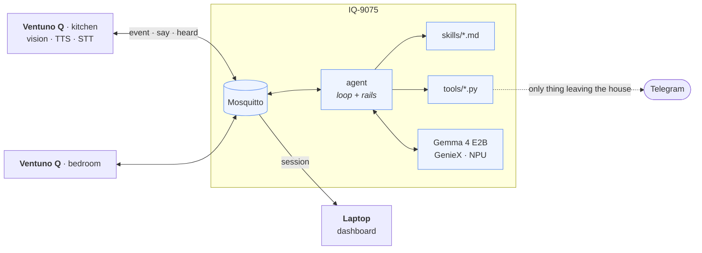
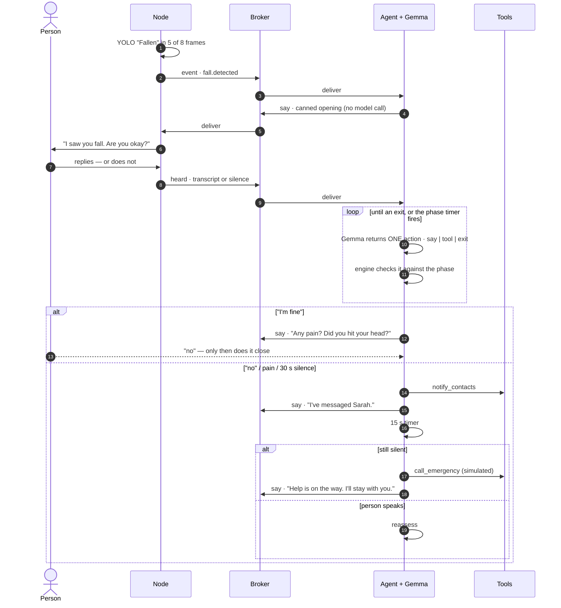
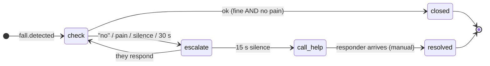
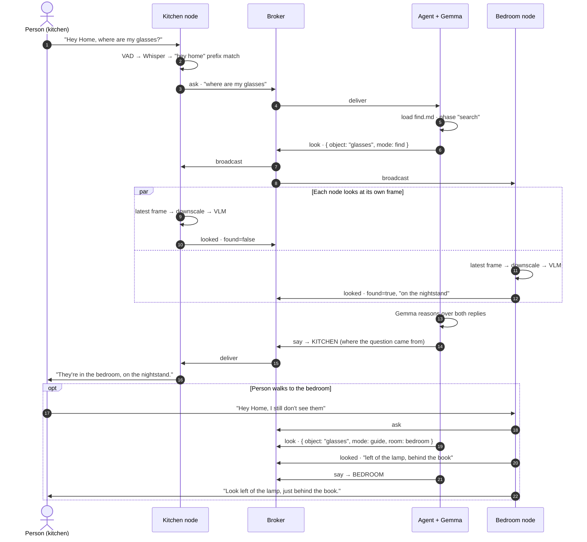

# QNet Home — Design

**QNet Home** is a privacy-first home system built on one event fabric, with capabilities added as pluggable skills. Two use cases are specified here: **fall detection and response** (§3–§9, plus a first-responder brief in §12) and **"where's my stuff"** (§13). They share the same nodes, broker, agent, skill format and dashboard — the second one exists partly to prove that.

*v0.4 — 2026-08-05. Written for end-to-end first: §15 is the build order, §17 is everything we deliberately left out and how to add it later. Numbers tagged `[M]` measured, `[?]` unmeasured — nothing `[?]` goes on a slide until it's measured.*

---

## 1. What it does

A room node watches for a fall and publishes an event — never video, never audio. An agent on the IQ-9075 picks it up, opens the offline emergency skill, and works through it: asks if the person is OK, listens, responds. "I'm fine" closes it — after one double-check for pain. Silence or "no" escalates — reassurance out loud, contacts notified, emergency call if there's still no answer — narrating each step so the person is never left in silence.

The second capability is the calm inverse. Someone says *"Hey Home, where are my glasses?"* — every room looks at its own current frame, answers in words, and the house replies out loud in the room the question was asked in.

Everything runs on-device. No frame and no audio clip ever leaves the room it was captured in; the only thing leaving the house is a message to a caregiver.

**The principle:** the agent runs the conversation; the engine guarantees the things that must not fail.

---

## 2. Devices

| Device | Role | Runs |
|---|---|---|
| Arduino Ventuno Q ×2 | Room node | Fall detection · VLM (Qwen3-VL-4B) · speech service · MQTT adapter |
| | | *Fall response uses **one** node. "Where's my stuff" uses both.* |
| IQ-9075 | Brain | Mosquitto · agent · Gemma 4 E2B via GenieX · skills · tools |
| Dell Snapdragon X Elite laptop | Dashboard | Web UI; also the required Windows `.EXE`/`.MSIX` |
| Phone | Caregiver | Telegram — no app to build |

Both edge devices run **Ubuntu**, so the node and the brain share one toolchain: `apt`, Python 3, GStreamer. The laptop is Windows on ARM64 with native Python already present.

**Peripherals on the node:** a USB camera with a built-in mic, plus a separate USB speaker. Both belong to the speech service (§9); nothing of ours touches audio devices. The combination has no hardware echo cancellation, which §9's speak-then-listen sequencing makes irrelevant.



---

## 3. End to end



---

## 4. The contract

MQTT is the only coupling between devices. Broker: Mosquitto on the IQ-9075 (`apt install mosquitto`, native ARM64). Clients: `paho-mqtt` on nodes and agent. Dashboard subscribes over Mosquitto's WebSocket listener on `:9001` — no backend API to write.

| Topic | Direction | Purpose |
|---|---|---|
| `qnet/<room>/event` | node → agent | Something happened (a fall) |
| `qnet/<room>/ask` | node → agent | A query — find ("hey home…") or a first-responder brief request |
| `qnet/<room>/say` | agent → node | Speak this |
| `qnet/<room>/heard` | node → agent | What was said |
| `qnet/look` | agent → **all** nodes | Look for X right now (broadcast) |
| `qnet/<room>/looked` | node → agent | What that node's VLM saw |
| `qnet/<room>/status` | node → all | Health |
| `qnet/session/<id>` | agent → dashboard | Session updates |

```jsonc
// qnet/kitchen/event
{ "id": "01JQ...", "ts": 1785790153.4, "room": "kitchen",
  "kind": "fall.detected", "conf": 0.87,
  "meta": { "cls": "Fallen", "frames": "5/8" } }

// qnet/kitchen/ask
{ "id": "01JR...", "ts": ..., "room": "kitchen", "text": "where are my glasses",
  "kind": "query" }
// kind: "responder_brief" when the phrase "I'm the first responder…" matches (§12) —
// "text" is then empty; the request needs no free text, just the room

// qnet/look            → { "qid": "q7", "object": "glasses", "mode": "find|guide",
//                          "room": null }   // guide mode targets one room
// qnet/kitchen/looked  → { "qid": "q7", "room": "kitchen", "found": true,
//                          "answer": "on the counter next to the kettle" }

// say      → { "text": "...", "prio": "safety|comfort" }
// heard    → { "text": "i'm fine", "silence": false }
// session  → { "id": "...", "room": "kitchen", "skill": "fall-response",
//              "urgency": "safety|routine", "phase": "escalate",
//              "state": "active|closed|cancelled", "log": [ ... ] }
```

**A "session" is one skill run, trigger to exit.** A fall is a session; a question is a session. The word is deliberately neutral so the dashboard and the engine don't have to care which use case they're looking at.

**Room identity comes for free.** The `ask` arrived on `qnet/<room>/ask`, so the answer goes back to `qnet/<same room>/say`. No person tracking, no speaker localisation, no cross-room correlation — the system replies where it was spoken to. This looks like it should be hard and isn't, which is worth saying out loud.

A session ends one of three ways: the agent takes a terminal exit (closed), the cancel matcher fires (cancelled), or a human resolves it from the dashboard. Nothing detects a responder arriving, so `resolved` is a manual action — say so rather than implying the system knows.

---

## 5. Modules

```
qnet/
  node/                 # plain Python services on Ubuntu, run under systemd
    vision.py           # camera → fall model → temporal check → publish
    voice.py            # MQTT ↔ HTTP adapter onto the speech service
    look.py             # subscribe look → latest frame → VLM → publish looked
  agent/engine.py       # the loop and the rails
  agent/llm.py          # GenieX client
  skills/fall.md        # knowledge + phases
  skills/find.md        # phases for "where's my stuff"
  tools/*.py            # one file per tool
  dashboard/index.html
  dev/inject.py         # publish any fixture: fall, ask, heard, looked (CLI, scriptable)
  dev/sim.html          # room simulator — a chat UI over MQTT; see below
  config/house.yaml     # rooms, name, contacts, thresholds
```

> **We are not using Arduino App Lab.** The board is ordinary Ubuntu, so these are ordinary Python services under systemd. That removes App Lab's one-app-per-board limit and its uncertain Windows-on-ARM tooling, at the cost of owning the model plumbing ourselves — which we were doing for the fall model anyway.
>
> `vision.py` owns the camera and exposes the latest frame in shared memory; `look.py` reads it rather than opening a second capture. The mic and speaker belong entirely to the speech service (§9), so nothing of ours opens them.

**The room simulator (`dev/sim.html`) — a chat UI standing in for a whole room.** A single HTML page with an MQTT client built in (`mqtt.js` over the broker's `:9001` WebSocket, same stack as the dashboard). You pick a room, type what a person would have *said aloud*, and the page publishes it exactly as the real node would — same three-way routing as the §9 adapter loop (responder phrase → `ask/responder_brief`; active session → `heard`; wake phrase → `ask/query`; anything else discarded and shown greyed out). A **Fall button** publishes the fall event for that room. Incoming `say` messages render as the house's chat bubbles, so an entire incident reads as a conversation.

Why it exists, stated once: **the agent never talks to the speech service — only the node's adapter does** — so everything brain-side (engine, skills, timers, cancel, notifications, LLM, dashboard) is fully exercisable with typed text before any audio hardware or speech service exists. Two honest limits: it cannot test audio-timing behaviour (half-duplex, say-interrupts-listen, VAD tuning — those need the real adapter and service), and its ~15 lines of routing JS deliberately mirror the adapter's Python — a small, accepted duplication for a dev tool; if the routing rules ever change, change both.

**Running it.** The speech service is a Docker container with a restart policy. Our three node services get systemd units with `Restart=always`, plus one `qnet-node.target` that pulls them up in order. On the brain: Mosquitto, GenieX and the agent, same pattern. The whole install should be *clone, edit `house.yaml`, run one script* — that sentence is what the 20-point Deployment criterion actually grades.

**Node identity: a local config file, nothing clever.** Each node's `config/node.yaml` holds `node_id` and `room`, set once at install. No IP mapping (DHCP moves), no registration flow (something to fail live). At boot the node publishes itself on `qnet/<room>/status`, so the dashboard learns which rooms exist without any registration protocol existing at all.

**Clocks.** Every event is timestamped and the dashboard renders a timeline, so drifting clocks make that timeline lie. All devices have internet, so Ubuntu's default `systemd-timesyncd` already handles it — just confirm it's enabled and move on.

Everything tunable lives in one file, so nothing above is a code change:

```yaml
resident: { name: "Margaret" }
contacts:
  - { name: "Sarah", telegram_chat_id: "TODO" }
telegram_bot_token: "TODO"
emergency_number: "911"
rooms:
  kitchen:
    node: kitchen-01
    source: "v4l2src device=/dev/video2"
vision:  { conf_floor: 0.6, fire_on: "5/8", rearm_after_s: 60 }
voice:
  speech_service_url: "http://localhost:8080"   # her service; it owns the audio devices
  wake_phrase: "hey home"
  responder_phrase: "i'm the first responder"    # checked before wake_phrase, any state
  idle_listen_timeout_s: 30
storage:
  sessions_dir: "data/sessions"   # one file per session, see §6
```

| Module | Device | Stack | Not its job |
|---|---|---|---|
| `node/vision` | Ventuno Q | Python, GStreamer, ONNX Runtime + QNN | Knows nothing about skills or the LLM |
| `node/voice` | Ventuno Q | Python; HTTP to the speech service | Decides nothing — a translator, not a brain |
| `node/look` | Ventuno Q | Python; `openai` SDK → local `geniex serve` (Qwen3-VL-4B) | Answers about its own frame only; never sends the frame |
| *speech service* | Ventuno Q | **Owned by a teammate** — existing HTTP service, STT + TTS | Knows nothing about QNet, MQTT or rooms |
| `agent` | IQ-9075 | Python asyncio · `paho-mqtt`, `pyyaml`, `httpx`, `openai` | No medical content, no hardcoded scenario |
| `skills/*.md` | IQ-9075 | Markdown + YAML | Not code |
| `tools/*.py` | IQ-9075 | Python | Adding a tool never edits the engine |

**No agent framework — four small, mature libraries instead.** `paho-mqtt` for the fabric, `pyyaml` for skill files, `httpx` for the speech service and Telegram, `openai` for every GenieX call (it's just an OpenAI-compatible endpoint, §10). The loop itself (§6) is ~20 lines; a framework would be more surface area to understand, not less, for logic this narrow.

Adding a use case should mean: a new detector, a new `.md`, maybe a new tool. Nothing else.

---

## 6. The agent

**Gemma is the agent.** It interprets replies, picks tools, composes speech. The skill file is the rails: what to achieve in each phase, which tools are allowed, when to move on, and a timer the engine enforces regardless.

| Agent decides | Engine guarantees |
|---|---|
| What to say | Timers fire on schedule |
| Which allowed tool to call | Tools outside the phase are refused |
| Whether the phase goal is met | `on_enter` actions already ran before the agent's first turn |
| How to read an ambiguous reply | Ambiguity resolves toward help |
| — | Every session is logged to disk, automatically |

One action per turn — small models are reliable single-turn, unreliable multi-turn.

**The same engine runs both use cases.** A fall skill has timers and `on_enter` actions; a query skill has neither. The only code difference is one line: **a missing `timer` means no timer.** Everything else — phases, allowlists, exits, the one-action loop — is identical, because it's all data in the skill file.

```python
async def run_phase(phase, session):
    if phase.opening:
        await say(phase.opening)              # canned: instant, can't be skipped
    for a in phase.on_enter:                  # e.g. notify_contacts, call_emergency
        if a not in session.on_enter_done:    # once per SESSION, not per entry —
            session.on_enter_done.add(a)      # escalate→check→escalate must not
            await execute(a)                  # send the caregiver a second alarm
    timer = start_timer(phase.timer)

    while not timer.fired:
        heard = await listen()
        if is_cancel(heard):
            if session.contacts_notified:
                await notify_contacts("false_alarm")
            return "cancelled"
        action = await llm.act(phase, session, heard)   # say | tool | exit
        if not phase.allows(action):
            log_refusal(action); continue
        await execute(action)
        if action.is_exit:
            return action.exit

    return phase.timer.goto
```

`on_enter` runs before the loop even starts, so by the time the model gets a single turn, notifications and the emergency call have already happened. That's what makes "the contacts always get notified" a property of the system rather than a hope about the model — stronger than the old `must` mechanism, which only guaranteed an action *before exit*, still routed through the agent. `on_enter` needs no such routing. The once-per-session guard matters because phases legally re-enter (escalate → check → escalate when someone responds and then goes silent again) — re-entry must not re-alarm the caregiver.

**How an exit resolves — one rule:** an exit whose name matches a phase id jumps to that phase; any other name **ends the session with that label as its final state**. So `check`'s `escalate` is a jump, while `ok`, `found`, `not_found`, `done` and `resolved` are terminal. This is why the skills need no explicit "closed" phase.

**Never leave them in silence.** During `escalate` and `call_help`, if nothing has been spoken for ~20 s the engine gives the agent a turn with the prompt "give a brief, true update" — grounded in what tools actually returned ("Sarah has been messaged", "it's been two minutes"), never filler. This was in the original vision, it's the emotional heart of the fall demo, and it's ~10 lines — so it's v1, not an optimization.

If Gemma is unavailable, the engine still walks the phases on their timers using the canned openings. Degraded, not broken — and a useful test.

**Cancel** is an engine-level interrupt, not an agent decision: every transcript is pattern-matched against the **explicit** phrases "cancel / stop / never mind / false alarm" before the agent sees it, and a match closes the session from wherever it was. **"I'm fine" is deliberately NOT a cancel phrase — it is a reply.** It goes to the agent, which routes it through the pain/head double-check (`check`'s `ok` exit, §7) instead of blindly closing the session; said mid-escalation, it takes `escalate`'s `check` exit and the agent reassesses. That double-check is a headline behaviour — an instant-close on "I'm fine" would make it unreachable. Cancel is for "this whole thing is a mistake"; "I'm fine" is information.

**If cancel fires after contacts were already notified, the engine automatically sends one follow-up message — "false alarm, they're okay."** Tracked with one boolean (`contacts_notified`, set the moment any notification goes out), checked at cancel time. Nobody should be left worrying because the system escalated and then went quiet.

**Caregiver notifications are automatic too, the same way logging is — never an LLM tool call.** `notify_contacts` and `call_emergency` fire the instant a phase is entered, unconditionally, with a canned message — not something the agent chooses to invoke. This removes the last piece of tool-calling risk from the fall path entirely: the model's only remaining job in `fall.md` is composing the comfort-loop update lines. Everything consequential — the timers, the notifications, the 911 call, the logging — is guaranteed by the engine regardless of what the model does. See §7 for the exact messages.

**Telegram gets milestones, not a live mirror of the dashboard.** The dashboard shows every event as it happens (§14); a caregiver's phone gets exactly up to three short pings per fall session — escalated, called for help, resolved/false-alarm — never the comfort-loop chatter. Constant pinging would be the nuisance the design is trying to avoid; the dashboard is where you watch, Telegram is where you get told.

**Every session writes its own file, automatically — not something the agent has to remember to do.** At session start the engine opens `data/sessions/<room>__<skill>__<started_at ISO8601>.jsonl` and keeps it open for the session's life. `say`, `listen`, every phase transition and every tool call append one line each, as they happen — not through a tool the LLM calls, but as a side effect of `run_phase` itself. One line each:

```jsonc
{"ts": 1785790153.4, "event": "detected", "kind": "fall.detected", "conf": 0.87}
{"ts": 1785790154.1, "event": "say",   "text": "I saw you fall. Are you okay?"}
{"ts": 1785790163.9, "event": "heard", "text": "", "silence": true}
{"ts": 1785790164.0, "event": "phase", "from": "check", "to": "escalate"}
{"ts": 1785790164.3, "event": "tool",  "tool": "notify_contacts", "result": "sent"}
{"ts": 1785790179.0, "event": "refusal", "tool": "call_emergency", "phase": "check"}
```

**The same events also go out live, not just to disk.** Every line above is published to `qnet/session/<id>` (§4) the instant it happens — the JSONL file and the dashboard's live feed are two destinations for the identical stream, not two separate mechanisms. So the dashboard isn't polling or reconstructing anything; it's just rendering MQTT messages as they arrive.

**"The latest" is a filesystem question, not a database query.** Because the filename starts with the room and carries the session's own start time, finding the most recent fall session in a room is `sorted(glob(f"data/sessions/{room}__fall-response__*.jsonl"))[-1]` — sort, take the last one, read it. No index, no shared file to corrupt, no session-ID bookkeeping. One session, one file, appended to for its whole life; a new session in that room simply opens a new file. This is also why it survives an agent restart mid-session: whatever was appended before the restart is still on disk under that timestamp.

This is why `log_session` disappears as a tool the LLM calls (§11) — logging must not depend on a model remembering to do it, the same reason timers and `on_enter` actions are engine-owned rather than agent-owned.

**One session per room, and safety wins.** A new trigger for a room that already has a live session is ignored. And a wake phrase is ignored entirely while a `safety` session is running in that room — if someone says "Hey Home" mid-escalation, the fall response keeps the floor rather than being derailed into a search. Two lines, and it will come up in testing.

**The responder brief is exempt — because it is not a session.** Like cancel, it's an engine-level interrupt (§12): pause the comfort loop → read the room's latest fall file → one LLM call to compose the summary → speak it → resume. It never enters the session table, so the one-session rule can't block it — which matters, since a responder arriving *mid-escalation* is exactly when the brief is needed. It's read-only against the live session's phases and timers, and it logs one `brief` line into the file it summarised.

---

## 7. Skill file

One markdown file: the knowledge, its citation, and the phases that use it. Changing the response means editing markdown, not Python.

````markdown
---
name: fall-response
trigger: fall.detected
urgency: safety            # safety takes over the dashboard; routine does not
source: IFRC 2020 First Aid Guidelines; AHA 2020 Highlights; "In Case of a Fall"
        (California DSS / IHSS Training Academy, adapted from US National
        Library of Medicine, 2013)
emergency_number: "911"
---

## Phases
```yaml
- id: check
  opening: "I saw you fall. Take a breath — are you okay?"   # canned, spoken instantly
  goal: "Find out whether they are hurt or need help."
  tools: []
  exits:
    ok:       "they clearly say they are fine and deny pain or hitting their head"
    escalate: "they say no, ask for help, report pain, or do not respond"
  timer: { after_s: 30, goto: escalate }

- id: escalate
  opening: "It's okay — I'm getting you help. Try to get comfortable, and
            don't strain to move."
  goal: "Keep them informed while help is on the way. Say what is actually
         happening, never filler — you have no tools to call, just talk."
  tools: []
  on_enter: [notify_contacts]     # fires automatically, canned message, no model
  exits:
    check: "they respond coherently — go back and reassess how they are"
  timer: { after_s: 15, goto: call_help }

- id: call_help
  opening: "You haven't answered, so I'm calling emergency services now."
  goal: "Stay with them and keep talking. You have no tools to call — the
         call is already being placed automatically."
  tools: []
  on_enter: [call_emergency, notify_contacts]
  exits:
    resolved: "a responder has arrived"
```

**`on_enter` replaces `must` for these two.** `must` meant "guaranteed before exit, enforced by the timer as a fallback" — reliable, but still routed through the agent's turn. `on_enter` is stronger: the action fires the instant the phase starts, no agent turn involved at all. Given how consequential these two are, "instant and automatic" is worth being more explicit than "guaranteed eventually."

**The three possible Telegram messages, templated, sent with no model call:**

```
escalate  on_enter → "🔴 Possible fall — {resident.name}, {room}. Checking on them now."
call_help on_enter → "📞 No response from {resident.name} — calling emergency services now ({room})."
cancel, if notified → "✅ False alarm — {resident.name} confirmed they're okay ({room}). No action needed."
```

**`{room}` is in all three, deliberately — it's already known (the event carries it, §4) and it's the one fact a trusted contact needs most to act on the message: which room to go to or describe to a dispatcher. Free to include, easy to forget, so it's spelled out here rather than left implicit.**

## Guidance
One instruction at a time, by name, calm and slow. Never say "emergency" first.
Do not tell them to get up. If they mention hip pain or hitting their head, escalate even if they said they were fine.
Say what is actually happening — "Sarah has been messaged", "it's been two minutes" — never filler.
Comfort/positioning guidance is said once, in the opening line — never repeated by the comfort loop. The loop's job is status, not instructions; repeating "get comfortable" every 20 seconds would read as nagging, not care.
````

**Where the comfort line comes from.** The official source is thinner than you'd expect — its entire guidance for someone who can't get up is *"try to get into a comfortable position and wait for help to arrive."* No checklist, which is itself the finding: official guidance for this moment is deliberately minimal, so a single reassuring line is the *correct* amount, not a compromise. `check`'s "take a breath" comes from the same source's first instruction after any fall.

**One deliberate wording call, flagged for the review pass (§18):** the source doesn't take a position on "stay still" vs. "reposition for comfort" — that's a real clinical judgment, not just phrasing, and it's exactly the kind of thing the human medical review must check before this goes in front of a judge as fact.

**Deliberately not built:** the source's detailed *"how to get up safely on your own"* steps (roll to side → seated → hands and knees → chair) are real and well-sourced, but they belong to the `ok` branch (someone who says they're fine and wants to stand), a different moment from "waiting for help." Out of scope for now — noted in §18 as a clean future addition to that branch, not this one.



If the person starts responding mid-escalation, the agent goes **back to `check`** and reassesses — escalation is not a one-way door. (Contacts stay notified; cancel handles the "false alarm" message.)

---

## 8. Fall detection

**Model:** [`melihuzunoglu/human-fall-detection`](https://huggingface.co/melihuzunoglu/human-fall-detection) — a YOLOv11 fine-tune, 640×640, three classes: **Fallen · Sitting · Standing**. The `Sitting` class earns its keep: distinguishing "on the floor" from "sat down" is exactly what a naive fall detector gets wrong, and here it's handled by the model instead of by hand-written geometry.

**Stack:** GStreamer → the model → publish `fall.detected` when the class is `Fallen`.

The GStreamer source is a config string, so a live camera and a recorded clip run the *same* code path:

```yaml
source: "v4l2src device=/dev/video2"                  # live
source: "filesrc location=clips/fall01.mp4 ! decodebin"   # demo / tuning
```

That matters twice: the demo can run from a video file with nothing else changed, and the same clips become the fixtures you measure the model against.

**Getting it on the NPU.** The repo ships only `best.pt`, so export once — `YOLO(path).export(format="onnx")` — then deploy it via the **QUAD framework** (internal Qualcomm tooling the team already uses) rather than hand-rolling the QNN plumbing. CPU inference on the same ONNX is the fallback for v1 if that path stalls; the interface doesn't change either way.

**Temporal check, about five lines.** Publish only when `Fallen` appears in N of the last M frames (start at 5 of 8). Single-frame classifiers flicker; this removes it without needing a state machine. N, M and the confidence floor live in `config/house.yaml` so tuning isn't a code change.

**Fire once, not continuously.** A fallen person keeps matching, so the detector would republish every frame. The node publishes `fall.detected` once, then stays armed-but-quiet until it sees `Standing` or `Sitting` for N frames (or a 60 s cooldown elapses). The agent also ignores new fall events for a room that already has a live session. Both are a few lines; without them the first real test floods the bus.

**No published metrics.** The model card reports no mAP or accuracy, so measure it on your own clips before quoting any number `[?]`.

**License: AGPL-3.0** (Ultralytics lineage) — see §18.

---

## 9. Voice

**STT and TTS come from a teammate's existing speech service** — always running on the node, owning the microphone and speaker directly. It knows nothing about QNet, MQTT or rooms, and **how it is built is entirely her call** — this section specifies only what it must *guarantee* (the contract), leaves her a section to fill in with the interface she actually exposes, and everything else here is our side of the seam.

`node/voice.py` is a thin **adapter** between our MQTT vocabulary and her interface — roughly 100 lines. Her service stays vanilla and reusable; our schema stays ours; neither inherits the other's assumptions.

### The contract — what the service must guarantee

These are behavioural requirements, deliberately silent about mechanism. Each has a *why*; R1–R5 are hard, R6 is a question with a fallback either way.

| # | Requirement | Why |
|---|---|---|
| **R1** | **Never capture while playing.** The service must not hear its own speech — speaking and listening never overlap, however it sequences that internally. | Mic and speaker share the room with no echo cancellation; overlap means the system transcribes its own voice and reads its own words back as the person's reply. Accepted cost: no mid-sentence interruption — which is why every spoken line is one short instruction. |
| **R2** | **Playback completion is knowable.** The caller can tell when a spoken line has actually finished (a blocking call, a completion callback — her choice). | The conversation is strictly speak-then-listen; without a completion signal the adapter can't sequence it. |
| **R3** | **One utterance per listen, endpointed by the service.** A listen returns the transcript of one utterance, with the service deciding when the person stopped talking (guideline: ~1.5 s of quiet, hard-capped so a noisy room can't capture forever). The caller never touches raw audio. | The adapter must stay a translator, not an audio processor. A fixed recording window technically satisfies this but responds ~3 s slower on short replies like "I'm fine" — worth avoiding if she can. |
| **R4** | **Listening is bounded and silence is distinguishable.** A listen accepts a caller-supplied timeout and returns an unambiguous "heard nothing" — distinct from any transcript and from an error. | Without it, a call in a silent room blocks forever; the engine's phase timers key off silence. |
| **R5** | **Everything stays on the node.** All audio processing is local; no audio, and no transcript, leaves the device via her service. What gets published, and where, is exclusively the adapter's decision. | The privacy claim in §1 has to hold at every component, not just ours. |
| **R6** | *(question, not requirement)* **Can an in-flight listen be cancelled?** | Lets a `say` interrupt listening (see the adapter loop). If no: we use short listen windows (~5 s) in a loop — slightly laggier, still correct, zero change on her side. The answer just decides which adapter shape gets built. |

*Background, informative only (not a prescription):* R3's endpointing is conventionally done with a VAD (voice activity detection) stage in front of the STT model — many Whisper wrappers bundle one — because STT models don't themselves know when a sentence ended and tend to hallucinate on silence. Whether her service does it that way, or some other way, is invisible to us and doesn't matter.

### The interface — hers to fill in

> **Owner: speech-service teammate.** Placeholders below are yours; fill them (or hand us the equivalent) and we transcribe the result into `contracts/speech-api.md`, which the adapter, its tests, and the T0.3 mock are then built against. Shapes are entirely your choice as long as R1–R5 hold.

| Item | Value |
|---|---|
| Transport & base URL | *TBD (e.g. HTTP on `localhost:<port>`)* |
| "Speak this text" call — path/schema, and how completion is signalled (R2) | *TBD* |
| "Listen once" call — path/schema, timeout parameter (R4), transcript + silence response shapes (R3, R4) | *TBD* |
| Error behaviour when the service is busy/starting/broken | *TBD — any detectable failure is fine; the adapter treats it as silence and the engine's timers carry on* |
| In-flight listen cancellation (R6) | *TBD: yes / no* |
| Measured: end-of-speech → transcript returned | *TBD s — goes to `measurements.md`* |

*Illustrative shape only — hers may differ:* `POST /speak {text}` returning after playback; `POST /listen {timeout_s}` returning `{text}` or `{silence: true}`. The adapter pseudocode below assumes this shape for readability.

### The adapter loop

The node is always in a `/listen` call; only the interpretation of the result changes:

```python
while True:
    active = session_active_in_this_room
    r = POST("/listen", timeout_s=phase_timeout if active else 30)

    if responder_phrase_matches(r.text):        # checked first, in ANY state
        publish(f"qnet/{room}/ask", {"kind": "responder_brief"})
    elif active:                                # the agent just asked something
        publish(f"qnet/{room}/heard", r)        # transcript or silence
    elif wake_phrase_matches(r.text):           # idle — "Hey Home…"
        publish(f"qnet/{room}/ask", {"kind": "query", "text": strip_wake_phrase(r.text)})
    # no match while idle → discard, loop
```

**The first-responder phrase is checked before anything else — the same way cancel is (§6).** It works whether the node is idle or mid-conversation, so it can never be swallowed as a reply to whatever the agent just asked. Silence during a session is published as `{"silence": true}` and the phase timer decides what happens next, so nothing can hang. **The adapter never interprets meaning** — "I'm ok" is just a transcript; the agent and the cancel matcher decide what it means.

**A `say` arriving mid-listen interrupts the listen.** This collision is guaranteed, not hypothetical: the comfort loop sends a `say` every ~20 s while the adapter may be blocked in a 15–30 s listen — without a rule, comfort lines queue behind listens and arrive late or bunched, exactly the dead air they exist to prevent. The rule: on `say`, the adapter cancels the in-flight listen, speaks, then resumes listening. **This is what R6 exists for.** If cancellation isn't available, the fallback is short listen windows (~5 s) in a loop, so a pending `say` waits at most 5 s — slightly laggier, still correct, no change on her side.

**Privacy note, stated rather than buried:** while idle, speech in the room is transcribed locally just to check for the wake phrase, then discarded — never published, logged, or sent anywhere. If that isn't tight enough, O11 puts a keyword-spotting model in front of STT so nothing is transcribed until the phrase fires.

---

## 10. LLM

**Stack:** GenieX on the IQ-9075 — the only IoT board Qualcomm's GenieX supports. `geniex serve` gives an OpenAI-compatible endpoint on `127.0.0.1:18181/v1`. **`agent/llm.py` calls it with the standard `openai` Python package, just pointed at a different `base_url`** — being OpenAI-compatible means a mature, well-tested client comes for free instead of hand-rolling HTTP and JSON parsing. Same trick on each node for its local VLM instance (§12): every GenieX endpoint, brain or node, is called identically, just a different URL.

**Model:** Gemma 4 E2B-it, Q4_0, 16k context.

Per turn we send ~1,200–2,000 tokens — role instructions, the current phase only, tool schemas for 2–4 tools, the conversation so far. 16k is ~8× headroom. Only the current phase is injected, because prefill time scales with tokens.

**Latency — measured on the actual board** (`setup/iq9-gemma-geniex/README.md`, 2026-08-05): **15.7–16.2 tok/s decode, TTFT ~0.18 s warm `[M]`**, Hexagon NPU confirmed active. A one-sentence spoken line (~25 tokens) ≈ 1.7 s — inside the 1–3 s/turn budget. The first line is canned and the timers are engine-owned, so a slow model never delays escalation regardless.

**Reliability — updated after on-device verification** (the setup log's appendix has the raw evidence; it supersedes the original plan here):
- **SDK-native tool-calling does not work on GenieX v0.3.18** — the model emits the tool call, but the server returns it as plain text; `tool_calls` stays null and `tool_choice: "required"` is not enforced.
- **Grammar constraints enforce correctly but crash the server** on v0.3.18 (the next generation dies; `json_schema` crashes instantly). systemd self-heals in ~10 s, but that's not a hot path to build on.
- **v1 therefore is: plain prompt → strip → parse JSON → validate against the expected enum → one retry → escalation path on repeated failure.** The phase allowlist refuses anything invalid anyway, so a wrong answer is never executed — this is precisely the model-failure class the rails were designed to absorb.
- **Every request carries GenieX's field names, not OpenAI's:** `enable_think: false` (Gemma otherwise reasons at length first; `think: false` is silently ignored) and `max_completion_tokens` (`max_tokens` is silently ignored). Belt-and-braces: still strip after the last `<channel|>` marker — a no-op when thinking is off. Pass `nctx: 16384` per request or start the service with `--nctx`; the server default is smaller than the 16k this section specifies.
- **Requests serialize** (one model, one queue): a comfort-loop line and a responder brief queue behind each other. Fine at ~2 s per capped request — and another reason the two fields above are mandatory on every call.
- Grammar-constrained decoding (O1, §17) remains the intended end state — **re-test the moment GenieX ≥ v0.3.19 ships**, since enforcement itself was demonstrated correct.

---

## 11. Tools

One file per tool, registered in a dict. The engine doesn't change when a tool is added — but not every tool is something the LLM chooses to call.

| Tool | Does | Invoked by | Stack |
|---|---|---|---|
| `notify_contacts` | Message the caregiver | Engine, `on_enter` (§7) — never the LLM | Telegram Bot API, one HTTPS POST |
| `call_emergency` | Emergency call | Engine, `on_enter` (§7) — never the LLM | **Simulated** — renders the exact payload it would have sent |
| `look_in_rooms` | Ask every node to look for an object now | LLM, in `find.md` | Broadcasts `look`, collects `looked` replies until ~8 s, returns them |
| `get_session_summary` | Read the room's most recent fall-response session, whole timeline | Engine, in the brief interrupt (§12) — the LLM only words the result | Latest file in `data/sessions/<room>__fall-response__*.jsonl` (§6, §12) |

The pattern: anything consequential enough that it must not depend on the model gets called by the engine directly. Session logging (`data/sessions/*.jsonl`) follows the same rule and isn't in this table at all — see §6.

---

## 12. Responder brief — use case 1 only

A first responder walks in and says *"I'm the first responder, can you tell me what happened?"* — the room answers with a spoken timeline: when the fall was detected, what the person said, what actions were taken and when, current status, elapsed time.

**"First responder" and "trusted contact" are two different roles — not the same word for the same person.** A trusted contact is whoever is in `house.yaml`'s `contacts:` list; they're who Telegram messages go to (§6), known to the system in advance. A first responder is whoever is physically in the room and says the phrase — a trusted contact who drove over, a paramedic, or a neighbour who heard something and came to check. The system has no way to know which, and doesn't try to: the brief is available to whoever asks, not gated to the contact list. That's also why the honest limitation below matters — it's the direct consequence of this design choice, not an oversight.

**Scoped deliberately to fall response.** It reads only sessions where `skill: fall-response`; a find session is invisible to it and vice versa. Keeping the two separate — as asked — is the whole point of routing it this way rather than folding it into the generic `ask`/find path.

**No new sensing, no new model.** Every fact it reports is already written to disk automatically as the fall session runs (§6). This is a formatter over data that exists, not a new capability — the same "one fabric, pluggable skills" test that use case 2 passed in §13.

**It is an interrupt, not a session (§6)** — that's what lets it run mid-escalation, when the one-session-per-room rule would block any new session. The engine's sequence: pause the comfort loop → read the room's latest fall file → one LLM call to word the timeline → speak it → resume the comfort loop. The fall session's phases and timers never notice. The skill file below carries only the *content* — the goal and phrasing guidance for that one LLM call — not phases to walk:

```yaml
---
name: responder-brief
trigger: kind=responder_brief
mode: interrupt            # no session, no phases, no urgency — one call, speak, done
---
goal: "Give a clear, factual timeline: when the fall was detected, what
       the person said or did, what actions were taken and when, current
       status, and total elapsed time. One flowing summary, not a list."
reads: latest fall-response file    # via get_session_summary (§11)
```

**Works mid-demo, which is the point.** `get_session_summary` reads the room's latest session **file live** — whatever has been appended so far. Ask thirty seconds into an escalation and the summary is "a fall was detected, no response after two prompts, contacts have just been notified"; ask after it resolves and the summary includes the whole arc. There is no separate "finalize the log" step and nothing to wait for — the file the responder reads is the same file the session is still writing.

If there's no fall session file for the room, it says so plainly: *"No fall has been recorded in this room."*

**One honest limitation, same pattern as the rest of the doc:** there is no identity check. Anyone who says the phrase gets the brief, including anything the person said (e.g. reported pain). Fine for a demo; a real deployment needs real access control.

---

## 13. Use case 2 — "Where's my stuff"

Same nodes, same broker, same agent, same skill format, same dashboard. It adds **a second way in**: a fall is system-initiated and urgent; finding something is person-initiated and calm.

| Entry | Trigger | Shape |
|---|---|---|
| Event | `qnet/<room>/event` | Agent speaks first, runs a phased skill with timers |
| Query | `qnet/<room>/ask` | Agent answers; no timers, usually two or three turns |

### The flow



Two things to notice. **Only text crosses the wire** — each node runs its own VLM on its own frame and returns a sentence, so the privacy claim is identical to use case 1. And **the answer is spoken where the question was asked**, because the reply goes back on the topic the `ask` arrived on.

### `skills/find.md`

```yaml
---
name: find-object
trigger: kind=query
urgency: routine
---
phases:
  - id: search
    goal: "Work out which room the object is in, then say so plainly."
    tools: [look_in_rooms]
    exits:
      found:     "at least one room reports seeing it"
      not_found: "no room reports seeing it"

  - id: guide
    goal: "They are in the right room but can't see it. Describe where it is
           relative to something obvious nearby."
    tools: [look_in_rooms]
    exits:
      done: "they have found it, or there is nothing more useful to say"
```

No timers, no `on_enter` actions — that's the whole difference from `fall.md`.

**How "I still don't see it" reaches `guide`.** A follow-up is a *new* `ask`, so something must connect it to the search it follows. The rule is deliberately dumb: **the agent remembers the last find result for 2 minutes.** A new `ask` that names no object ("I still don't see them") within that window → `guide` phase, using the remembered object and the room the person is speaking from now. Any `ask` that names an object → fresh `search`. One `last_find` variable and one if-statement — no conversation history, no session linking.

### When a node doesn't answer

`look_in_rooms` broadcasts and then waits — but a node can be down, busy running its own VLM, or off the network. The rule: **wait up to ~8 s, then answer with whatever came back, and say what was actually checked.**

The agent knows how many nodes it expects (from `house.yaml`), so it can tell three different situations apart, and they should not sound the same:

| Replies | What it says |
|---|---|
| All nodes answered, one found it | "They're in the bedroom, on the nightstand." |
| All answered, none found it | "I looked in the kitchen and the bedroom and I don't see them." |
| Some didn't answer | "I looked in the kitchen and don't see them — I couldn't reach the bedroom." |

That third row is the one worth building. Silently reporting "not found" when you only managed to check half the house is the kind of thing that makes people stop trusting a system.

### Capture and cost

The node is already running a camera pipeline for fall detection, so `look` takes the **latest frame already in memory** — no second capture path, no rolling buffer. Timing needn't be exact; a frame up to a second old is fine for a stationary object.

**Downscale before the VLM.** Feed roughly 640 px, never the camera's native resolution. Off-platform evidence (an AMD NPU, *not* Qualcomm — so directional, not a number to quote) shows VLM time-to-first-token growing by more than 10× from 720p to 4K. Downscaling is nearly free and is the biggest single lever on query latency.

**Latency target: answer within ~6 s of the question ending.** The budget: STT ~0.5 s + one Gemma turn 1–3 s + the slower of the two VLMs (they run in parallel) `[?]`. The `look_in_rooms` timeout is the knob — 8 s is the ceiling, not the goal; once VLM latency is measured, set the timeout to measured + 1 s so a dead node doesn't make every answer slow. Engineer this number at rehearsal, don't discover it on stage.

### Known limitation, stated rather than hidden

**Live look only finds what is currently visible.** Glasses in a drawer, under a newspaper, or in a room with no node all produce "sorry, I don't see them." This is a deliberate v1 choice — the fix is a last-sighting cache (O10, §17), which turns a dead end into "I last saw them on the kitchen counter about an hour ago."

### Wake word

**There is no wake-word model.** The "wake phrase" is a plain string check on the transcript the speech service already returned: lowercase it, strip punctuation, and require it to **start with "hey home"** (small edit-distance tolerance so "hey, home" and "hi home" pass). Match → publish `ask` with the remainder as the query. No match → discard, and nothing is published.

Requiring the literal phrase is what stops ordinary conversation triggering the system, and it is a far stronger filter than asking the agent to judge whether speech was aimed at it. Someone asking *another person* "where are my glasses?" must not make the house answer. Letting the LLM decide intent would also mean a model call on every utterance in the room — slower, less reliable, and it would put all household conversation in front of the model.

Note the fall use case doesn't use the phrase at all: during an active session the agent has just asked a question, so any speech is treated as the reply.

Why not a trained keyword model: zero new models to build or train, the wake phrase is a config string, and it reuses the listen loop we're writing anyway. Audio is transcribed locally and discarded unless it matches, so only matched text ever leaves the node: the same "process locally, emit semantics" rule as everywhere else.

If it proves trigger-happy, the fallback is a small keyword-spotting model in front of STT so the speech service is only called after the phrase fires. **Not openWakeWord's pretrained weights — CC-BY-NC-SA, incompatible with our AGPL.** Its Apache-2.0 code is fine; the weights aren't shippable. Training our own from synthetic speech is about an hour.

### Why this matters beyond the feature

Adding a whole second capability touched: one new node module, one new skill file, one new tool, three topic names. The engine, the phase loop, the transport and the fall path are untouched. That is the "one fabric, pluggable skills" claim in §1 being demonstrably true rather than asserted — and it's the strongest thing to show a judge who asks whether this generalises.

---

## 14. Dashboard

**Stack:** a single `index.html` with `mqtt.js` subscribing to Mosquitto's WebSocket listener on `:9001`. No build step, no npm, no backend API. Packaged for Windows by wrapping it in a WebView window: PyInstaller `--onedir` → `makeappx` → `.MSIX`.

It is a **home** dashboard, not a fall alarm — so it shows sessions, and a session is a session whether it's a fall or a question.

| Area | Shows |
|---|---|
| **Home** | Floor plan, node status, what's happening now |
| **Activity** | One list of sessions, falls and questions together, newest first. Click for the transcript, current phase, tools called, and any refused tool calls |
| **System** | Telemetry — NPU utilisation, per-stage latency, bytes on the wire vs what video would have cost |

**One rule, driven by data rather than hard-coded:** a session whose skill declares `urgency: safety` **takes over the whole screen**; a `routine` session just appears in Activity. So a fall always interrupts, a question never does, and any future skill gets the right behaviour by setting one frontmatter field.

Who it's for: **voice is the resident's interface, the screen is the caregiver's.** The person who fell talks to the room. The person looking for their glasses talks to the room. The dashboard is where family sees what happened and where the system's behaviour is inspectable.

Worth building deliberately: **refused tool calls shown inline in the transcript.** Watching the engine decline an out-of-phase action is the clearest evidence the rails are real rather than described.

**The live feed is color-coded by `event` kind — same field the JSONL already carries (§6), so this is pure rendering, no new data.** Six kinds, six treatments, deliberately few:

| `event` | Color | Why |
|---|---|---|
| `say` | neutral blue | the system talking |
| `heard` | neutral gray | the person talking |
| `detected` / `phase` | amber, darkening at each escalation step | visually shows the incident getting more serious as it goes |
| `tool: notify_contacts` | green | a real, successful, reassuring action |
| `tool: call_emergency` | **solid red, bold border, an un-missable "SIMULATED" badge on the line itself** | see below — this one is not just styling |
| `refusal` | muted gray, dashed border | the rails declining something, not an alarm |
| session closed / cancelled | green | resolved |

**The `call_emergency` treatment is a requirement, not a preference.** It's the one truly irreversible action in the whole system, and it's simulated (§11) — a judge or a bystander glancing at the screen must never be able to mistake it for a real call. Red + bold border makes it the most visually alarming line in the feed (correctly — it's the most serious moment), and the word "SIMULATED" sits on the line itself, not in a tooltip or a legend someone has to find. §16 turns this into a demo beat: point at the red line out loud when it fires.

---

## 15. Build order — end to end first

Each step leaves something that runs. Don't start the next until the current one works.

| # | Milestone | Done when |
|---|---|---|
| 1 | **Spine** | `dev/inject.py` publishes a fake fall → agent receives → node speaks a hardcoded line out of a real speaker |
| 2 | **Voice loop** | Node transcribes a reply and the agent prints it |
| 3 | **Phases** | Skill file drives check → escalate → call_help on timers, with canned lines only. **No LLM yet** |
| 4 | **Tools** | Telegram message actually arrives; 911 path renders its simulated payload |
| 5 | **Gemma** | LLM chooses exits and words the lines instead of the canned path |
| 6 | **Real detection** | `node/vision` replaces the injector |
| 7 | **Dashboard** | One page: room status, session list, a `safety` session takes over the screen, and the System panel shows live latency + bytes-on-the-wire (worth marks — Technical is 40%) |
| 8 | **Package** | `.EXE`/`.MSIX` builds and installs on a clean machine |
| 9 | **Responder brief** | Saying "I'm the first responder, what happened?" gets a spoken timeline matching the real session log — mid-escalation and after close |

Then use case 2, which reuses everything above:

| # | Milestone | Done when |
|---|---|---|
| 10 | **Wake word** | Saying "Hey Home, where are my glasses" publishes an `ask` with the right text |
| 11 | **Look round trip** | `look` broadcast → both nodes reply `looked` with canned answers → agent speaks in the asking room |
| 12 | **VLM on node** | GenieX + Qwen3-VL-4B replaces the canned answer and gets it right on a real object |
| 13 | **Guide follow-up** | "I still don't see it" produces a useful positional description |

Steps 1–4 give a working, demoable system with **no model in the loop at all**. That's deliberate: it's the fallback if Gemma or GenieX misbehaves, and it's what you show if the demo goes wrong.

**Day-one checks, each with a fallback:**
0. **Ask about the speech service's `/listen` — before anyone writes the adapter.** Does it do VAD endpointing, and does it take a timeout? Whisper itself has neither; it depends entirely on the wrapper (`faster-whisper`, `whisper.cpp` and `sherpa-onnx` all bundle Silero VAD; OpenAI's original package does not). If there's no VAD, fall back to a fixed 5 s listening window and say so in the doc. **This blocks the voice loop, so it is question one, not question five.**
1. MQTT round trip on real hardware, before anything is built on top.
2. Gemma 4 E2B under GenieX on QCS9075 — unmeasured `[?]`. Fallback: smaller model, shorter context, or run it on the laptop.
3. The speech service running on the Ventuno Q: sound out of the speaker, a transcript back from the mic.
4. Export the fall model to ONNX and get one inference running — NPU if it cooperates, CPU if not.
5. Packaging spike — Deployment is 20% of the score.

**Hardware probe — run this first, it answers most of the unknowns in ten minutes.**

```bash
# --- IQ-9075: does the brain have what the design assumes? ---
free -h                      # RAM: Gemma 4 E2B Q4_0 is ~2.8 GB + KV cache for 16k ctx
cat /etc/os-release; lscpu   # Ubuntu version, cores
ls /dev/fastrpc* 2>/dev/null # NPU access present?
which geniex || echo "GenieX not installed"
ls /usr/lib/rfsa/ 2>/dev/null # QAIRT/QNN runtime libs

# --- Ventuno Q: camera and the two audio devices ---
v4l2-ctl --list-devices
v4l2-ctl -d /dev/video2 --list-formats-ext   # resolutions and fps actually offered
arecord -l                   # capture: the camera's mic
aplay -l                     # playback: the USB speaker

# --- Which silicon is this actually? ---
cat /sys/devices/soc0/machine; cat /sys/devices/soc0/soc_id
# Our research puts Ventuno Q at IQ8 / QCS8275-class; a third id (qcs8300)
# appears in the container evidence. Settle it before quoting any spec.

# --- Network: can they actually reach each other? ---
ip -4 addr                   # same subnet?
ping -c3 <iq9-ip>            # from the node
```

**Extra checks for use case 2:**
- **Does GenieX install and serve Qwen3-VL-4B on the Ventuno Q?** GenieX's Linux ARM64 support names QCS9075 (the brain); the node looks like QCS8275-class. Assumed to work; if it doesn't, the fallback is running the VLM on the IQ-9075 and sending it a downscaled frame — which weakens the claim from "no image leaves the room" to "no image leaves the home," so say it honestly if it happens.
- **Do the node's services co-reside in 16 GB** — Qwen3-VL-4B, the speech service's models, and the fall detector? Untested. If it's tight, load the VLM on demand and unload after.
- **VLM latency on a 640 px frame.** No Qwen3-VL measurement exists on Ventuno Q or any Dragonwing part, anywhere. Two nodes answer in parallel, so the query budget is one VLM call, not two.
- **Wake-phrase false triggers** over ten minutes of normal room noise and conversation.

The RAM figure is the one that can change the design: if the IQ-9075 is tight, the fallbacks are a shorter context, a smaller model, or moving the LLM to the laptop.

---

## 16. Demo and rehearsal

Detail later; the shape now so the build serves it.

- **The fall is a prop or a recorded video file**, not a person — safer, repeatable, and it makes threshold tuning a fixed input rather than a performance.
- `dev/inject.py` stays the backstop: if the camera misbehaves on the day, the same session runs from an injected event and nothing else changes. `dev/sim.html` is the second understudy — if the *speech* side misbehaves, the conversation runs typed, live, on screen; it also makes a good judging visual (the transcript as chat while audio plays).
- One room, one node for this use case.
- Rehearse both interruptions a judge will try: **"I'm fine" mid-escalation** (a *reply* — the agent reassesses and runs the pain double-check, §6) and **"false alarm"** (a *cancel* — session closes and the caregiver gets the follow-up message). They look similar and behave differently on purpose; the demo should show both.
- Rehearse the responder brief mid-escalation, too — a judge asking "what would a real responder see?" is likely, and the phrase must land whether the fall is still active or already resolved.
- **Reset between runs is not free:** the 60 s re-arm cooldown and the one-session-per-room rule both block an immediate second run. Give the dashboard a "reset room" button that clears the session and re-arms the detector — one MQTT message, and it makes back-to-back demo runs painless.
- **Never hide the simulation.** When `call_emergency` fires, the dashboard's red "SIMULATED" line (§14) is the moment to point at it and say so out loud — a fake 911 call is fine to demo, a fake 911 call nobody flags as fake is not.

To be written closer to the day: the run of show, who says what, and the reset procedure between runs.

---

## 17. Optimizations — add after it works

Deliberately not in v1. Each says where it plugs in, so adding it is local.

| # | Optimization | Why | Effort | Plugs in at |
|---|---|---|---|---|
| O1 | Grammar-constrained LLM output | Model can't emit a malformed action. **Status: verified to enforce correctly on the server, but crashes GenieX v0.3.18 (§10) — blocked until ≥ v0.3.19, then re-test** | 1 h once unblocked | `agent/llm.py` |
| O2 | 60 s suppression window after cancel/stand-down | Stops the same room re-triggering while they get up | 1 h | `agent/engine.py` |
| O4 | Barge-in — interrupt TTS when the person starts talking | Feels alive rather than scripted. **Blocked on hardware:** needs a USB conference speakerphone with hardware AEC, not the current camera-mic + separate speaker | 3 h + hardware | speech service |
| O5 | Audio corroboration — loud impact raises fall confidence | Fewer false positives | 2 h | `node/vision.py` |
| O7 | Refused-tool-call panel | Watching the engine decline an out-of-phase action proves the rails are real | 1 h | `dashboard/` |
| O8 | `set_room_light` tool | Helps responders; reads well on camera | 1 h | `tools/` |
| O9 | Second room / handoff between nodes | Multi-device story | 2 h | `agent/engine.py` |
| O10 | **Last-sighting cache** — remember each successful find, so "I don't see them" becomes "I last saw them on the kitchen counter about an hour ago" | Turns every failed search from a dead end into a useful answer; most of the perceived intelligence for very little code | 2 h | `agent/engine.py` |
| O11 | Keyword-spotting model as a cheap pre-gate before calling STT | Only if the wake phrase proves trigger-happy | 2 h | `node/voice.py` |
| O12 | **EdgeTAM object tracking** (Apache-2.0, ~18 ms/frame) emitting `object.moved` / `object.left_room` | The real memory path — track a specific object from one click, no class list, no training | 1 d | `node/look.py`, `agent/` |
| O13 | Single GStreamer pipeline shared by the fall detector and the VLM's frame grab | One capture, one decode, no duplicated work — and it's a measurable number | 3 h | `node/vision.py` |

**Priority if time is short:** O1 first — it protects the demo. (The comfort loop and the telemetry panel were promoted into v1: §6 and §14.)

---

## 18. Open items

- **Licence: settled — the project is AGPL-3.0.** The fall model carries Ultralytics' AGPL terms and it is strong copyleft, so the whole project follows. `LICENSE` holds the verbatim FSF text and the README carries the copyright notice. Two small compliance follow-ups during the build: put the standard AGPL header comment at the top of each source file, and — because AGPL §13 covers network interaction — put a "source" link to the repository in the dashboard footer.
- **TODO — Telegram setup.** Create the bot via `@BotFather`, get the token and the caregiver's chat ID, put both in `config/house.yaml`. Milestone 4 is blocked until this exists.
- **TODO — the LLM prompt template.** §10 says what goes into the prompt; the actual wording is a build-time task. Write it once, in `agent/llm.py`, so three versions don't appear.
- Resident name and caregiver contacts for `config/house.yaml`.
- Region — the skill assumes US / 911.
- Owner per module.
- **The emergency content needs a human review pass against its cited sources before any clinical claim.** It relays lay-rescuer guidance; it is not a medical device. Specifically flagged (§7): the "get comfortable, don't strain to move" wording is a judgment call between two source-adjacent framings, not a direct quote — check it before anyone states it as authoritative on stage.
- **Future addition, not this pass:** the "how to get up safely" steps from the same source (roll to side → seated → hands/knees → chair) belong on the `ok` branch, a natural Phase 1.1 rather than scope for now.
- Broker unreachable: not handled. On a controlled demo LAN it shouldn't arise. Real fix is buffering on the node.
- No vitals sensing. `query_vitals` doesn't exist; a ~$25 mmWave module would answer "is he breathing" without a bystander.
- One person per room assumed; no identity, by design.
- Session files (`data/sessions/*.jsonl`) are never cleaned up. A non-issue for a demo; a real deployment needs a retention policy (e.g. delete after 30 days).
