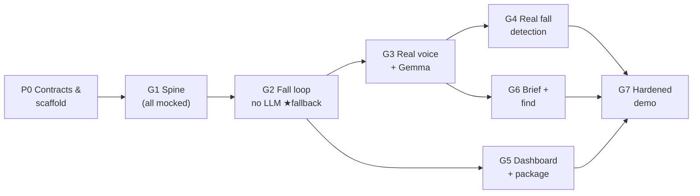

# QNet Home — Implementation Plan

*v1.2 — 2026-08-05. Companion to `docs/DESIGN.md` (v0.4): the design says what; this says in what order, by whom, and how we know each piece works. Every task carries an explicit **Verify** block — commands plus expected observables — so an independent agent can decide "done or not" without asking anyone. v1.2 adds the **room simulator** (T1.2b) and re-scopes the speech mock accordingly.*

## Where we are (updated 2026-08-05)

- ✅ **T3.2 done** — Gemma 4 E2B serving on the IQ-9075 via GenieX/systemd, measured, NPU-confirmed (`setup/iq9-gemma-geniex/README.md`). The LLM endpoint exists before the agent does.
- 🔨 **Speech service** — colleague aligned and building; she fills the DESIGN §9 interface placeholders against requirements R1–R6; the result lands in `contracts/speech-api.md` (T0.2).
- **Key consequence for sequencing:** because the agent only ever reads/writes MQTT — it never calls the speech service directly — **everything brain-side runs on typed text via the room simulator before any audio exists.** G1 and G2 do *not* depend on the speech mock (T0.3); it gates only the node's voice adapter (T1.4).
- **First wave to launch (parallel):** ① foundation (T0.4 + T0.1) · ② IQ9 infra (T1.1 broker + the T3.2 `--nctx` residual, over `ssh iq9`) · ③ lane A (T1.2 injector + T1.2b simulator + T1.3 agent skeleton). T0.5 (Telegram bot, 5 min, human) alongside.

## Ordering philosophy

1. **Contracts before code.** Three interfaces are shared by everything — the MQTT contract, the speech-service contract (requirements ours, interface hers — DESIGN §9), and the config files. They get frozen first so all lanes can build in parallel without stepping on each other.
2. **Mock-first, hardware-last.** Every stage runs on a laptop against mocks before it touches a board. Hardware appears as a *substitution* into a working system, never as an integration event.
3. **End-to-end at every gate.** Each gate (G1–G7) is a runnable demo, strictly better than the last. If the schedule collapses, the latest passed gate *is* the demo. G2 — the full fall loop with **no model in the loop** — is the designated fallback build.
4. Within a phase, tasks can go out of order or in parallel; **gates are the sync points.**



## Lanes (who runs in parallel)

| Lane | Owns | Tasks |
|---|---|---|
| **A — Agent/brain** | engine, skills, LLM, tools, dev tooling | T1.2 · T1.2b · T1.3 · T2.1–T2.4 · T3.3–T3.4 · T6.1–T6.2 |
| **B — Node** | vision, voice adapter, node VLM | T0.3 · T1.4 · T3.1 · T4.1–T4.3 · T6.3–T6.4 |
| **C — Infra/UI** | broker, dashboard, packaging, systemd | T1.1 · T5.1–T5.3 · T7.1 |
| **D — Human/hardware** | alignment, credentials, probes, GenieX installs | T0.2 · T0.5 · T0.6 · T3.2 |

## Definition of done — the rules every task follows

1. **A task is done only when its Verify block passes, run verbatim.** If any step can't be run (missing hardware, missing credential), the task is *not done* — it's blocked, and the blocker gets written next to it.
2. **Save the evidence.** Each completed task commits its verification output to `verify/<task-id>.txt` (copy-paste of the terminal, or the pytest tail). Cheap, and it means "done" is auditable later without re-running everything.
3. **Manual checks are checklists, not vibes.** Where a human must look (dashboard rendering, audible speech), the Verify block enumerates exactly what to observe, item by item; every item must be individually confirmed.
4. **Done stays done.** Before marking any task complete, re-run the newest passed gate's checklist. If your change broke it, your task isn't done yet.
5. Scenario tests from T2.2 are the regression suite; **`--no-llm` must never break.**

---

## Phase 0 — Alignment and scaffolding *(everything depends on this; do first, in parallel)*

**T0.1 · Freeze the wire contract** — lane A
From DESIGN §4, produce `contracts/mqtt.md` (every topic, direction, QoS) plus `contracts/fixtures/*.json` — one valid sample payload per message type. These fixtures are consumed by the tests, by `dev/inject.py`, **and by `dev/sim.html`** — three consumers, one source of truth.
*Verify:*
```
ls contracts/fixtures/
  → exactly these 8 files: event_fall.json, ask_query.json, ask_responder_brief.json,
    say.json, heard.json, look.json, looked.json, session.json
pytest tests/test_contracts.py -q
  → "8 passed" (one test per fixture, asserting required fields per DESIGN §4)
grep -c "qnet/" contracts/mqtt.md   → ≥ 8 (every topic documented)
```

**T0.2 · Speech-service contract sign-off** — lane D · **blocks T0.3, T1.4**
DESIGN §9 separates *requirements* (R1–R6, ours to demand) from *interface* (hers to design — we don't specify her implementation). This task: walk R1–R6 with the owner; **she fills the "The interface — hers to fill in" placeholder table in DESIGN §9** with whatever shapes she chooses; transcribe the result into `contracts/speech-api.md` — the machine-referenced copy that the adapter, its tests, and the T0.3 mock are built against.
*Verify:*
```
DESIGN §9 interface table: zero cells still "TBD" (the measured-latency row may say
  "pending hardware" — it's the only exception)
contracts/speech-api.md contains:
  [ ] one row per requirement R1–R6: "Requirement | How the interface satisfies it" —
      R6 answered "no" is a PASS if the row names the short-listen-window fallback
  [ ] her actual call shapes: paths/verbs, request & response schemas, error behaviour
  [ ] a line "Agreed with <owner name>, <date>" — added by her or in her presence
Any requirement row that is blank or hand-waved ("should be fine") is a FAIL.
```

**T0.3 · Mock speech service** — lane B · needs T0.2 · **gates only T1.4, nothing else**
A small stub implementing **whatever interface she recorded in `contracts/speech-api.md`** — shape unknown until T0.2 lands, which is exactly why this waits for it. Behaviourally: "speak" simulates blocking playback (~80 ms/word); "listen" pops scripted replies from `mock/replies.txt` or returns the agreed silence shape at timeout.
Scope note (v1.2): faking *the person* is the room simulator's job (T1.2b), which needs no speech interface at all — this mock's one remaining purpose is developing the node's voice adapter (T1.4) before/alongside her real service. Don't block anything else on it.
*Verify (calls below assume the illustrative `/speak`–`/listen` shape from DESIGN §9 — **substitute her agreed shapes from `contracts/speech-api.md`**; the behaviours checked are the contract, R1–R4, regardless of shape):*
```
time <speak call> "one two three four five six"
  → returns AFTER ≥ 0.4 s (completion knowable / blocking — R2, simulating R1 sequencing)
echo "i'm fine" >> mock/replies.txt
<listen call, timeout 5>    → the agreed transcript shape carrying "i'm fine" (R3)
<listen call, timeout 2>    (empty queue)
  → the agreed silence shape after ~2 s, not before, not never (R4)
```

**T0.4 · Repo scaffold** — lane C
`qnet/` layout from DESIGN §5, `pyproject.toml` (deps: `paho-mqtt`, `pyyaml`, `httpx`, `openai`), config templates, AGPL headers.
*Verify (clean checkout):*
```
pip install -e .                       → exit 0
python -m qnet.agent --help            → prints usage, exit 0
grep -rL "GNU Affero" qnet/ --include='*.py'  → empty (every .py carries the header)
test -f config/house.yaml && test -f config/node.yaml   → both exist, parse with
python -c "import yaml,sys; yaml.safe_load(open('config/house.yaml'))"  → exit 0
```

**T0.5 · External credentials and names** — lane D (human)
Telegram bot + chat id + resident/caregiver names into `config/house.yaml`.
*Verify:*
```
grep -E "telegram_bot_token|telegram_chat_id" config/house.yaml | grep -c TODO  → 0
curl -s "https://api.telegram.org/bot$TOKEN/sendMessage" -d chat_id=$CHAT -d text="qnet T0.5 check"
  → HTTP 200, "ok":true — AND the caregiver's phone visibly shows the message
grep -E "resident:|name:" config/house.yaml   → real names, no TODO
```

**T0.6 · Hardware probe** — lane D (human)
Run the probe block from DESIGN §15 on the IQ-9075 and both Ventuno Qs; record into `docs/measurements.md`.
*Verify:*
```
docs/measurements.md contains, per device (3 sections):
  [ ] SoC id line (from /sys/devices/soc0/machine)   [ ] RAM (free -h)
  [ ] OS/kernel   [ ] /dev/fastrpc* listing   [ ] camera formats (nodes only)
  [ ] ALSA capture+playback devices (nodes only)   [ ] ping RTT to the broker host
Any surprise (missing NPU node, <8 GB RAM) is written as an ISSUE line, not omitted.
(IQ-9075 section: already satisfied by setup/iq9-gemma-geniex/README.md — link it.)
```

---

## Phase 1 — The spine *(Gate G1)*

**T1.1 · Broker** — lane C
Mosquitto on the IQ-9075 (and a local dev instance): LAN listener + WebSocket on `:9001`; config at `infra/mosquitto.conf`.
*Verify (two terminals, two machines):*
```
machine A: mosquitto_sub -h <broker-ip> -t 'qnet/#' -v
machine B: mosquitto_pub -h <broker-ip> -t 'qnet/test' -m 'hello'
  → terminal A prints "qnet/test hello" within 1 s
browser: connect mqtt.js to ws://<broker-ip>:9001, subscribe qnet/#, repeat pub
  → message appears in the browser console
```

**T1.2 · Event injector** — lane A
`dev/inject.py` publishing any T0.1 fixture, one subcommand per message type:
```
inject.py fall   --room kitchen
inject.py heard  --room kitchen --text "i'm fine"        # play the person's reply
inject.py heard  --room kitchen --silence                # play a timeout
inject.py ask    --room kitchen --kind query --text "where are my glasses"
inject.py ask    --room kitchen --kind responder_brief
inject.py looked --room bedroom --qid q1 --found --answer "on the nightstand"   # fake a node's VLM reply
```
`heard` and `looked` are what make the injector a complete stand-in for rooms: with them, every brain-side path — including the find flow — is drivable from scripts with no speech and no cameras.
*Verify:*
```
for each subcommand: mosquitto_sub -t 'qnet/#' -C 1 &  then run it
  → captured topic and payload match the corresponding contracts/fixtures/*.json
    in every required field (jq keys), with the CLI's overrides applied
inject.py heard --silence  → payload has silence:true and empty text
```

**T1.2b · Room simulator** — lane A · needs T1.1 + T0.1 · *(spec: DESIGN §5, "The room simulator")*
`dev/sim.html` — one HTML page, no build step, `mqtt.js` over the broker's `:9001` WebSocket. A chat UI that stands in for an entire room: room selector, **Fall button** (publishes the fall fixture for that room), a text box where typed input is routed exactly as the real adapter routes transcripts — responder phrase → `ask/responder_brief`, active session → `heard`, wake phrase → `ask/query`, anything else discarded and rendered greyed. Incoming `say` for the selected room renders as the house's chat bubbles; session state (active/phase/closed) shown from `qnet/session/#`. Session-active detection subscribes to the same session events the dashboard uses — no private hooks.
*Verify (broker + agent skeleton running; `mosquitto_sub -t 'qnet/#' -v` alongside):*
```
[ ] Fall button → qnet/kitchen/event matching the fixture; a chat bubble appears when the agent says
[ ] mid-session, type "i'm fine"        → qnet/kitchen/heard {"text":"i'm fine",...}
[ ] no session, type "hey home where are my keys" → ask kind=query, text stripped of the wake phrase
[ ] no session, type "nice weather today"         → NOTHING published; line shown greyed in the UI
[ ] any state, type "i'm the first responder what happened" → ask kind=responder_brief
[ ] switch room to bedroom → messages publish on bedroom topics; kitchen bubbles stop rendering
[ ] the routing JS mirrors node/voice.py's rules — a comment in BOTH files points at the other
    ("routing duplicated in dev/sim.html / node/voice.py — change both")
```

**T1.3 · Agent skeleton** — lane A · needs T1.2
Async MQTT client; session table (one-per-room, safety-wins, brief-exemption stubbed); on `fall.detected`: open session, hardcoded `say`, `session` events, per-session JSONL file.
*Verify (agent + broker running):*
```
mosquitto_sub -t 'qnet/#' -v &   then   python dev/inject.py fall --room kitchen
  → within 2 s the sub shows BOTH: qnet/kitchen/say {...} AND qnet/session/<id> {"state":"active",...}
ls data/sessions/   → exactly one file matching kitchen__fall-response__*.jsonl
python -c "import json,sys; [json.loads(l) for l in open(sys.argv[1])]" data/sessions/kitchen__*.jsonl
  → exit 0 (every line valid JSON)
python dev/inject.py fall --room kitchen   (again, same live session)
  → NO new session file, NO second say (one-session-per-room rule observable)
```

**T1.4 · Voice adapter v0** — lane B · needs T0.3
`node/voice.py` against the mock: the §9 adapter loop — responder phrase first, session-active → `heard`, wake phrase → `ask`; say-interrupts-listen (or the short-window fallback, per R6's answer from T0.2).
*Verify (mock + broker + agent running; watch `mosquitto_sub -t 'qnet/#' -v`):*
```
1. inject fall → mock's stdout shows the say text (spoken via /speak)
2. echo "i'm fine" >> mock/replies.txt        → bus shows qnet/kitchen/heard {"text":"i'm fine",...}
3. (no session) echo "hey home where are my keys" >> mock/replies.txt
                                              → bus shows qnet/kitchen/ask kind=query text="where are my keys"
4. (no session) echo "what a nice day" >> mock/replies.txt
                                              → NOTHING on the bus (discard path works)
5. (mid-session) echo "i'm the first responder what happened" >> mock/replies.txt
                                              → bus shows ask kind=responder_brief
6. interrupt check: while /listen is pending, publish a say
                                              → mock logs /speak starting ≤ 5 s later (not after the full listen timeout)
```

**★ Gate G1 checklist** — zero audio required: with broker + agent skeleton up, run the **T1.3 checks** and the **T1.2b simulator checklist** back-to-back (a whole "conversation" typed in chat: Fall button → say bubble → typed reply → `heard` on the bus). T1.4's checks join the gate when the mock exists, but **do not hold the gate for them** — the adapter re-verifies at T3.1 against the real service anyway. All checks green → tag `g1-spine`.

---

## Phase 2 — Fall loop on rails, no LLM *(Gate G2: the fallback demo build)*

**T2.1 · Skill loader** — lane A
`agent/phases.py` + `skills/fall.md` exactly per DESIGN §7; load-time validation.
*Verify:*
```
pytest tests/test_skill_loader.py -q → all pass, and the test file demonstrably includes:
  test_fall_md_loads, test_exit_naming_missing_phase_fails,
  test_unknown_on_enter_action_fails, test_timer_shape_validated,
  test_exit_resolution_rule (phase-name → jump, other → terminal)
```

**T2.2 · Engine: phases, timers, cancel, logging** — lane A · needs T2.1
`run_phase` per DESIGN §6: engine timers; `on_enter` once-per-session; explicit-phrase cancel; exit resolution; JSONL + live events; `--no-llm` regex mode.
*Verify — these four are THE regression suite from here on:*
```
pytest tests/test_scenarios.py -q → 4 passed:
  test_silence_full_escalation      (silence → escalate@30s → notify fired → call_help@+15s
                                     → simulated call fired; JSONL contains phase lines in order)
  test_im_fine_double_check         ("i'm fine" → pain question asked → "no" → state=closed;
                                     asserts the pain question TEXT was said before closing)
  test_false_alarm_followup         ("false alarm" mid-escalate → state=cancelled AND a
                                     second notify_contacts with "false alarm" text was emitted)
  test_reentry_single_notification  (escalate → check → escalate again → notify_contacts
                                     emitted EXACTLY once across the whole session)
Also: rerun T1.3's duplicate-inject check → still no second session (rule survived the rewrite).
```

**T2.3 · Tools v0** — lane A · needs T0.5 (stubs allowed sooner)
`notify_contacts` (Telegram, console fallback), `call_emergency` (simulated payload), `get_session_summary`, `look_in_rooms` (canned). Registry with engine-only flags per DESIGN §11.
*Verify:*
```
pytest tests/test_tools.py -q → all pass, including:
  test_notify_message_contains_room, test_call_emergency_payload_marked_simulated,
  test_get_session_summary_reads_latest_file, test_registry_engine_only_flags
Live check: run scenario test_silence_full_escalation with the real token
  → caregiver's phone shows "🔴 Possible fall — <name>, kitchen..." (human confirms, notes in verify/T2.3.txt)
```

**T2.4 · Comfort loop** — lane A · needs T2.2
~20 s grounded updates during escalate/call_help; drops rather than overlaps.
*Verify:*
```
python dev/soak_comfort.py --minutes 2      (scripted: injected fall, silence throughout)
  → exits 0, printing its own assertions:
    [ ] ≥ 4 comfort utterances, gaps between speech 15–30 s (never > 35 s of silence)
    [ ] zero overlapping /speak calls (mock timestamps strictly sequential)
    [ ] every elapsed-time claim within ±5 s of truth
```

**★ Gate G2 checklist** — one command (`scripts/demo_fallback.sh`) starts broker+agent and replays the full incident via injected messages (no speech stack involved):
```
[ ] script exits 0 and prints PASS          [ ] all 4 scenario tests green
[ ] Telegram arrived with room name         [ ] SIMULATED payload rendered
[ ] data/sessions has the full timeline     [ ] tag pushed: g2-fallback  ← the demo of last resort
[ ] interactive replay: the same incident driven by hand in dev/sim.html — Fall button,
    typed "i'm fine", typed "false alarm" — behaves identically to the scripted run
```
G2 in sim form is also the **"silent-film" demo**: the whole fall narrative visible as chat + dashboard + real Telegram, before any microphone exists.

---

## Phase 3 — Real voice and real LLM *(Gate G3)*

**T3.1 · Speech service on the Ventuno Q** — lane B+D · needs T0.2
Her container on the node; point the adapter's `speech_service_url` at it (one config change).
*Verify (standing in the room):*
```
[ ] inject fall → the room SPEAKER audibly asks the opening question
[ ] answer "I'm fine" out loud → qnet/<room>/heard appears with a transcript containing "fine"
[ ] stay silent through a listen → heard arrives with silence:true (not a hang, not garbage)
[ ] say-interrupt or short-window behaviour matches T0.2's answer (re-run T1.4 check 6 against real service)
[ ] measured: seconds from end-of-speech → heard on bus, 5 trials, median recorded in measurements.md
```

**T3.2 · GenieX + Gemma on the IQ-9075** — lane D · ✅ **DONE 2026-08-05** — see `setup/iq9-gemma-geniex/README.md`
Measured `[M]`: 15.7–16.2 tok/s, TTFT 0.18 s warm, NPU confirmed. Served via systemd, survives reboot. Findings folded into DESIGN §10: native tool-calling broken on v0.3.18, grammar enforces-but-crashes, `enable_think`/`max_completion_tokens` are the real field names.
*Residual (verifiable):*
```
[ ] systemd unit gains --nctx 16384 (or every client request sends nctx) — check:
    grep nctx /etc/systemd/system/geniex-serve.service  OR  grep nctx qnet/agent/llm.py
[ ] after ANY geniex update or model re-pull: rerun setup/iq9-gemma-geniex/tests/ → all pass
```

**T3.3 · LLM client + prompt** — lane A · needs T3.2 ✅
`agent/llm.py` per the updated DESIGN §10 — NOT SDK `tools=`: prompt → strip after last `<channel|>` → parse JSON → validate against the phase's allowed actions → one retry → escalation path. The prompt template lives here and only here.
*Verify:*
```
pytest tests/test_llm_replay.py -q → passes, and the harness asserts ALL of:
  [ ] 10 scripted reply variants → expected exits matched ≥ 9/10
      ("i'm fine" / "my hip hurts" / "help" / "no" / garbled / silence / off-topic / …)
  [ ] every outbound request body contains enable_think:false AND max_completion_tokens
  [ ] a deliberately-invalid model reply (patched in) → exactly one retry, then the
      escalation fallback — never an exception, never an executed invalid action
  [ ] wall time per call < 5 s against the live IQ-9075 endpoint
```

**T3.4 · LLM into the engine** — lane A · needs T2.2 + T3.3
Behind a flag: Gemma classifies exits and words comfort lines (grounded facts injected).
*Verify:*
```
pytest tests/test_scenarios.py -q --llm      → 4 passed (same four, real model)
pytest tests/test_scenarios.py -q            → 4 passed (--no-llm untouched — this is the rails' CI)
diff of one comfort line between modes shows the LLM wording differs but the FACTS match the tool log
```

**★ Gate G3 checklist** — in the room: real fall injection → audible question → spoken "I'm fine" → audible pain question → spoken "no" → audible close. Then the silence path through to the simulated call. Both observed end-to-end; `verify/G3.txt` records who watched it and the measured turn latencies.

---

## Phase 4 — Real fall detection *(Gate G4)* — lane B

**T4.1 · Model export + runtime** — needs T0.6
`best.pt` → ONNX 640×640; QUAD/QNN attempt; CPU fallback; measure both.
*Verify:*
```
python dev/detect_one.py assets/lying_person.jpg   → prints class=Fallen conf>0.5
python dev/detect_one.py assets/standing_person.jpg → prints class=Standing
measurements.md gains: ms/frame on NPU (or "NPU: blocked — <error>") AND ms/frame on CPU,
plus which one was selected and why
```

**T4.2 · `node/vision.py`** — needs T4.1
GStreamer source from config (v4l2 **and** filesrc); 5-of-8 temporal check; fire-once + 60 s re-arm; heartbeat; latest-frame export for `look.py`.
*Verify:*
```
mosquitto_sub -t 'qnet/kitchen/event' -v &
python -m qnet.node.vision --source "filesrc location=clips/fall01.mp4 ! decodebin"
  → EXACTLY one fall.detected for the whole clip (count the lines)
run again with clips/fall_then_recover_then_fall.mp4
  → two events, ≥ 60 s apart per the re-arm rule (or per recovery frames)
mosquitto_sub -t 'qnet/kitchen/status' -C 2   → heartbeats flowing
test -f /dev/shm/qnet_kitchen_frame.jpg (or the chosen path) and it's < 2 s old while running
live camera + prop → same single-event behaviour, observed once and noted in verify/T4.2.txt
```

**T4.3 · Clips + thresholds** — lane B/D
4–6 recorded clips (falls, fast sit-downs, walk-throughs); tune `conf_floor` and N-of-M.
*Verify:*
```
python dev/eval_clips.py clips/   → prints a table: clip | expected | fired
  PASS criteria: every fall clip fired=yes, every sit/walk clip fired=no
  The table is pasted into measurements.md — these are our only accuracy numbers (model card has none)
```

**★ Gate G4 checklist** — `fall01.mp4` played through the file source triggers the *entire* G3 flow with no injector involved. One command, observed, logged.

---

## Phase 5 — Dashboard and packaging *(Gate G5)* — lane C, parallel from G2

**T5.1 · Dashboard page** — needs T1.1
`index.html` + `mqtt.js` per DESIGN §14: three areas, color-coded feed, safety takeover, reset button, AGPL footer link.
*Verify (replay `dev/replay_session.py <recorded session>` + live injects; check each item):*
```
[ ] say=blue, heard=gray, phase/detected=amber (darkening), notify=green, refusal=gray-dashed
[ ] call_emergency line: red, bold border, literal "SIMULATED" text ON the line
[ ] inject fall → full-screen takeover ≤ 1 s; find-query ask → NO takeover (urgency respected)
[ ] session close → returns to normal view; Activity list shows both sessions newest-first
[ ] reset button → publishes the reset message (see it on mosquitto_sub) and a new inject re-triggers
[ ] footer links to the repo (AGPL §13 duty, DESIGN §18)
```

**T5.2 · Telemetry panel** — needs T2.2
Per-stage latency stamps + bytes-on-the-wire counter.
*Verify:* run one live incident; panel's detect→speak number equals the JSONL timestamp delta ±0.2 s; bytes counter within 10% of `mosquitto_sub -v | wc -c` for the same window.

**T5.3 · Windows package** — lane C
WebView wrapper → PyInstaller `--onedir` → `makeappx` → `.MSIX`.
*Verify (on a machine with no dev environment):*
```
[ ] MSIX installs without errors  [ ] app launches from Start menu
[ ] enter broker IP in settings → live feed appears (verified against an inject)
[ ] uninstall leaves no broken state; reinstall works
```

**★ Gate G5 checklist** — T5.1's full checklist + T5.3 on the clean machine, evidence in `verify/G5.txt`.

---

## Phase 6 — Responder brief and "Where's my stuff" *(Gate G6)*

**T6.1 · Responder-brief interrupt** — lane A · needs T2.2, T3.3
Engine interrupt per DESIGN §12: pause comfort → read latest fall file → one LLM call → speak → resume. Not a session.
*Verify:*
```
pytest tests/test_responder_brief.py -q → 3 passed:
  test_brief_mid_escalation   (fall session ACTIVE: brief speaks a timeline naming ≥3 real
                               logged facts; fall session's phase and timers unchanged after)
  test_brief_after_close      (summary includes detection, replies, actions, final state)
  test_brief_no_history       (fresh room → says "No fall has been recorded", nothing else)
Also live once: say the phrase to the real node mid-escalation → audible brief, comfort loop
audibly resumes after. Noted in verify/T6.1.txt.
```

**T6.2 · Find skill + routing** — lane A · needs T2.2
`skills/find.md`; `last_find` 2-minute memory; real `look_in_rooms` (broadcast, collect ≤ timeout, unreachable-rooms list).
*Verify:*
```
pytest tests/test_find.py -q → passes, including:
  test_found_other_room      ("They're in the bedroom..." spoken in the ASKING room's say topic)
  test_found_nowhere         (answer NAMES both searched rooms)
  test_one_node_silent       (answer names the searched room AND says it couldn't reach the other)
  test_followup_routes_to_guide   (object-less ask ≤2 min later → guide phase, remembered object)
  test_followup_expired      (object-less ask >2 min later → does NOT guide; asks what to find)
  test_new_object_new_search ("where is my phone" right after → fresh search, not guide)
```

**T6.3 · VLM on the nodes** — lane B+D · needs T0.6
GenieX + Qwen3-VL-4B per node; `node/look.py`: latest frame → ~640 px → prompt → `looked`. Fallback: VLM on the brain (weaker privacy claim, documented).
*Verify:*
```
on-node: curl the local :18181/v1 with a test image → coherent answer text
place glasses on a surface in view:
  mosquitto_pub qnet/look '{"qid":"t1","object":"glasses","mode":"find"}'
  → qnet/<room>/looked with found=true and a location phrase mentioning a nearby object
remove them → same look → found=false
measurements.md gains VLM ms/query on a 640 px frame; config's look timeout = measured + 1 s
  (check: grep look_timeout config/house.yaml against the recorded number)
```

**T6.4 · Wake-phrase soak** — lane B
*Verify:*
```
python dev/wake_soak.py --minutes 10   (room with normal conversation + TV audible)
  → prints false-trigger count: MUST be 0
5 spoken trials of "hey home, where are my glasses" from ~3 m
  → ≥ 4/5 produce a correct ask (log the 5 transcripts in verify/T6.4.txt)
```

**★ Gate G6 checklist** — live, in sequence, no injector: ask in room A → answer names room B → walk to B, "I still don't see them" → positional guidance; then the responder-brief live check from T6.1. All observed, logged.

---

## Phase 7 — Hardening and demo *(Gate G7: show-ready)*

**T7.1 · Service-ification + install script** — lane C
systemd units + `install.sh` per device class; README's from-scratch steps become real.
*Verify:*
```
power-cycle ALL boards simultaneously; within 3 minutes and zero keystrokes:
  [ ] broker answers mosquitto_sub          [ ] geniex /v1/models answers
  [ ] every node heartbeats on qnet/+/status [ ] dashboard reconnects by itself
inject fall → full flow works post-reboot
README test: a teammate who didn't write it follows it verbatim on the laptop → dashboard connects
```

**T7.2 · Run of show + rehearsal** — everyone · needs G3–G6
`docs/DEMO.md`: beats for both use cases + the brief; the two interruption rehearsals ("I'm fine" = reassess vs "false alarm" = cancel + follow-up); reset procedure; injector understudy.
*Verify:*
```
[ ] two consecutive full runs pass with a reset in between (timestamps in verify/G7.txt)
[ ] one run with the camera deliberately unplugged — injector carries the fall beat seamlessly
[ ] both interruption rehearsals performed and behave per DESIGN §6
[ ] grep '\[?\]' docs/DEMO.md → empty: every number in the script is [M] or the claim was cut
```

---

## Standing rules for anyone (human or agent) picking up a task

- **DESIGN.md is the spec; this file is the sequence.** If implementation forces a design change, change `DESIGN.md` in the same commit and say so.
- **Contracts are sacred:** any change to topics, payloads, or the speech API updates `contracts/` + fixtures in the same commit, or it didn't happen.
- **Done = Verify block passed verbatim + evidence in `verify/<task-id>.txt` + newest gate still green.**
- Numbers go to `docs/measurements.md` with `[M]`; nothing `[?]` reaches a slide (DESIGN header rule).
- New code files carry the AGPL header (DESIGN §18).
