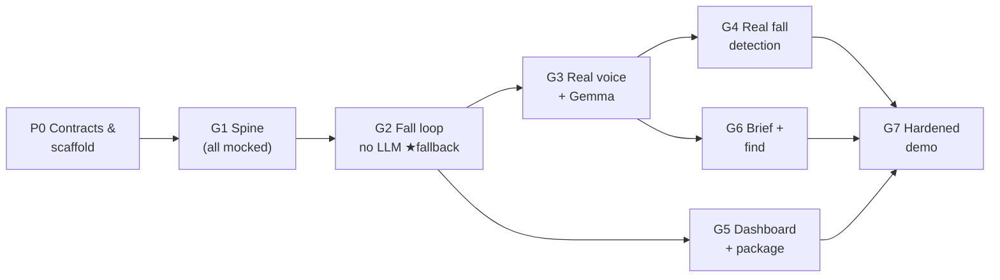

# QNet Home — Implementation Plan

*v1.0 — 2026-08-05. Companion to `docs/DESIGN.md` (v0.4): the design says what; this says in what order, by whom, and how we know each piece works. Tasks are written so a subagent (or teammate) can pick one up cold: every task names its inputs, its deliverable, and a concrete "done when" that can be run.*

## Ordering philosophy

1. **Contracts before code.** Three interfaces are shared by everything — the MQTT contract, the Arduino App CLI ASR/TTS behavior, and the config files. They get frozen first so all lanes can build in parallel without stepping on each other.
2. **Mock-first, hardware-last.** Every stage runs on a laptop against mocks before it touches a board. Hardware appears as a *substitution* into a working system, never as an integration event.
3. **End-to-end at every gate.** Each gate (G1–G7) is a runnable demo, strictly better than the last. If the schedule collapses, the latest passed gate *is* the demo. G2 in particular — the full fall loop with **no model in the loop** — is the designated fallback build.
4. Within a phase, tasks can go out of order or in parallel; **gates are the sync points.**

## Lanes (who runs in parallel)

| Lane | Owns | Tasks |
|---|---|---|
| **A — Agent/brain** | engine, skills, LLM, tools | T1.3 · T2.1–T2.4 · T3.3–T3.4 · T6.1–T6.2 |
| **B — Node** | vision, combined Arduino voice App, node VLM | T0.2–T0.3 · T1.4 · T3.1 · T4.1–T4.3 · T6.3–T6.4 |
| **C — Infra/UI** | broker, dashboard, packaging, systemd | T1.1 · T5.1–T5.3 · T7.1 |
| **D — Human/hardware** | credentials, probes, real-device acceptance, GenieX installs | T0.5 · T0.6 · T3.1–T3.2 |

---

## Phase 0 — Alignment and scaffolding *(everything depends on this; do first, in parallel)*

**T0.1 · Freeze the wire contract** — lane A · ✅ **DONE 2026-08-05**
From DESIGN §4, produce `contracts/mqtt.md` (every topic, direction, QoS) plus `contracts/fixtures/*.json` — one valid sample payload per message type (`event`, `ask` both kinds, `say`, `heard`, `look`, `looked`, `session`). These fixtures are the shared test data for every later task.
*Done when:* fixtures exist for all 8 message types and a 20-line `pytest` validates each against required fields. Any later change to the contract must change this file in the same commit.

**T0.2 · Freeze the Arduino speech runtime contract** — lane B · ✅ **DONE 2026-08-05** · **blocks T0.3, T1.4**
Inspect the installed Ventuno Q App runtime and record in `contracts/arduino-speech.md`: App CLI/App Bricks versions, lifecycle calls, whether `tts.speak` is synchronous, ASR VAD/endpointing behavior, timeout/silence behavior, cancellation semantics, and visible USB devices. The final architecture uses the built-in `arduino:asr` and `arduino:tts` bricks; there is no HTTP speech service.
*Done when:* the doc answers every behavior explicitly from installed source or a real-device measurement, identifies every remaining Phase 1 hardware acceptance test, and records that upgrades must rerun those tests.

**T0.3 · Mock Arduino speech objects** — lane B · ✅ **DONE 2026-08-05** · needs T0.2
Implement injectable `FakeASR` and `FakeTTS` objects matching `contracts/arduino-speech.md`: scripted transcript, silence, blocking listen, cooperative cancellation that may leave a partial result, blocking playback, and failures. Add a fake MQTT transport so the controller can be tested on a laptop with no Arduino packages or hardware.
*Done when:* host tests prove the fakes reproduce transcript, silence, failure, partial-on-cancel, blocking playback, and recorded MQTT output. T1.4 then uses those fakes to prove continuous rolling text, `heard`, cancellation-discard, and resume behavior.

**Phase-0 migration note:** the hardware-spike voice/router code predates the
frozen fixture payloads. Its topic names are aligned (`ask`, `say`, `status`),
but T1.4 must replace its legacy `schema_version`/`message_id` TTS envelope with
the exact fixture shapes before the next hardware deployment. The fixtures, not
the spike, are authoritative from this point forward.

**T0.4 · Repo scaffold** — lane C
Create the `qnet/` layout from DESIGN §5, `pyproject.toml` (deps: `paho-mqtt`, `pyyaml`, `httpx`, `openai`), `config/house.yaml` and `config/node.yaml` templates matching DESIGN §5, empty module files with AGPL headers, `README` run instructions stub.
*Done when:* `pip install -e .` succeeds and `python -m qnet.agent --help` runs on a clean checkout.

**T0.5 · External credentials and names** — lane D (human)
Create the Telegram bot via `@BotFather`; capture bot token and the caregiver chat id into `config/house.yaml`. Fill in resident name, caregiver name, confirm region/911. Nothing else can send a real notification until this exists.
*Done when:* a hand-run `curl` to the Telegram API delivers a message to the caregiver's phone.

**T0.6 · Hardware probe** — lane D (human)
Run the probe block from DESIGN §15 on the IQ-9075 and both Ventuno Qs. Record into `docs/measurements.md`: SoC ids, RAM, Ubuntu versions, `/dev/fastrpc*`, GenieX presence, camera formats/fps, ALSA devices, ping between boxes.
*Done when:* `measurements.md` has a filled table per device and flags any surprise (tight RAM, missing NPU device nodes) as an issue.

---

## Phase 1 — The spine *(Gate G1: fake fall → spoken line → typed reply, all on one laptop)*

**T1.1 · Broker** — lane C · ✅ **IMPLEMENTED + LOCAL PROCESS VERIFIED 2026-08-05**
Mosquitto on the IQ-9075 (and a local dev instance): allow LAN, WebSocket listener on `:9001`. Config committed at `infra/mosquitto.conf`.
*Done when:* `mosquitto_sub -t 'qnet/#'` on the laptop sees a message published from another machine.

**T1.2 · Event injector** — lane A · ✅ **DONE 2026-08-05**
`dev/inject.py`: publish any fixture from T0.1 to the right topic — `inject.py fall --room kitchen`, `inject.py ask --kind query --text "where are my glasses"`, `inject.py ask --kind responder_brief`. This is both the dev tool and the demo backstop (DESIGN §16).
*Done when:* each subcommand produces a broker message identical to its fixture.

**T1.3 · Agent skeleton** — lane A · ✅ **DONE 2026-08-05** · needs T1.2
`agent/engine.py` v0: async MQTT client; session table with the one-session-per-room rule, safety-wins rule, and the responder-brief exemption stubbed; on `fall.detected` open a session, publish a **hardcoded** `say`, publish `session` events, write the per-session JSONL file (DESIGN §6 naming). No phases, no LLM.
*Done when:* `inject.py fall` → a `say` and a `session(open)` appear on the bus and a correctly-named file appears in `data/sessions/`.

**T1.4 · Combined Arduino voice App v0** — lane B · ✅ **HOST ACCEPTANCE DONE 2026-08-05** · needs T0.3
Complete `apps/ventuno-q/qhome-voice-node`: subscribe `say` → enqueue `tts.speak`; use one `asr.transcribe_until_cancelled()` stream while idle and bounded `transcribe_sentence(timeout=...)` during safety sessions; preserve a 10-second rolling transcript and send idle finals to IQ9 for LLM activation/intent routing. Implement the explicit `LISTENING → CANCELLING_LISTEN → SPEAKING → POST_TTS_GUARD` state machine, priority queue, cancellation-generation discard, buffer reset at TTS boundaries, status publication, and host-test dependency injection.
*Done when:* with agent (T1.3) + fakes: injected fall → fake TTS speaks; scripted `i'm fine` → `heard`; scripted silence → `heard {silence:true}`; background plus `hey home where are my keys` → rolling query `ask`; responder phrase mid-session → `ask kind=responder_brief`; a `say` arriving during listen produces no leaked partial transcript and ASR stays inactive for all TTS playback.

**Phase-1 verification note (2026-08-05):** `pytest -q tests` passes all
43 tests, including the complete fake fall-to-spoken-check-to-`heard` path. A
real process smoke on alternate ports started the aMQTT TCP and WebSocket
listeners, router, and agent; an MQTT fall produced exact `session` and `say`
messages, and a reply was appended to the same JSONL session. The coordinated
IQ9 + Ventuno hardware rollout is deliberately left pending because the current
workstation has no non-interactive SSH authorization for the IQ9. T3.1 remains
the real audio/reboot/50-cycle acceptance gate.

---

## Phase 2 — Fall loop on rails, no LLM *(Gate G2: the fallback demo build)*

**T2.1 · Skill loader** — lane A
`agent/phases.py`: parse frontmatter + phases YAML; author `skills/fall.md` exactly per DESIGN §7. Validate at load: every exit either names a phase or is terminal (DESIGN §6 rule), `on_enter` actions exist in the tool registry, timers well-formed.
*Done when:* unit tests pass, including: a skill with an exit naming a nonexistent phase fails loading with a clear error.

**T2.2 · Engine: phases, timers, cancel, logging** — lane A · needs T2.1
Implement `run_phase` from DESIGN §6 for real: engine-owned timers; `on_enter` once-per-session; **explicit-phrase cancel only** ("cancel/stop/never mind/false alarm" — "I'm fine" is a reply); exit resolution; JSONL + live `session` events for every step; the `--no-llm` mode where a trivial regex maps replies (yes/fine → ok-path, no/help → escalate) and all speech is the canned openings.
*Done when:* scripted end-to-end tests (Arduino speech fakes, injector) pass: **(a)** silence all the way → escalate at 30 s → contacts action at entry → call_help at +15 s → simulated call fires; **(b)** "I'm fine" → pain double-check question → "no" → session closes `ok`; **(c)** "false alarm" mid-escalation → session cancelled **and** a false-alarm follow-up action is emitted; **(d)** escalate→check→escalate re-entry emits **exactly one** contacts notification.

**T2.3 · Tools v0** — lane A · needs T0.5 (can stub sooner)
`tools/`: `notify_contacts` (Telegram POST; falls back to console+file if token absent), `call_emergency` (renders the exact simulated payload, marks it SIMULATED), `get_session_summary` (latest `<room>__fall-response__*.jsonl`, parsed to a timeline dict), `look_in_rooms` (stub returning canned `looked` replies for now). Registry dict per DESIGN §11, including the engine-only flags.
*Done when:* unit tests pass and, during T2.2's scenario (a), a real Telegram message with `{room}` in it arrives on the caregiver's phone.

**T2.4 · Comfort loop** — lane A · needs T2.2
The ~20 s "brief, true update" nudge during escalate/call_help (DESIGN §6): canned grounded lines in no-LLM mode ("Sarah has been messaged", elapsed time). Must coordinate with the adapter's listen (this is where the say-interrupts-listen rule earns its keep).
*Done when:* a 2-minute soak of scenario (a) shows updates roughly every 20 s, no overlapping speech, and elapsed-time lines that are actually correct.

**★ Gate G2 check:** one command (`make demo-fallback` or a script) starts broker + agent + mock + dashboard-less log tail and runs the full fall incident from injection to simulated 911 with Telegram messages arriving. **Tag this commit** — it is the demo-of-last-resort.

---

## Phase 3 — Real voice and real LLM *(Gate G3)* — lanes B and D in parallel with A

**T3.1 · Real Arduino voice acceptance on the Ventuno Q** — lane B+D · needs T1.4
Deploy the combined App and substitute real Arduino ASR/TTS for the fakes. Verify VAD endpointing, cancellation-generation discard, strict half duplex, silence timeout, stable USB device selection, and the post-TTS guard in a real room. Repeat after a reboot.
*Done when:* standing in the room: injected fall → the speaker asks, you answer aloud, the transcript lands on `heard`; a `say` sent mid-listen cancels ASR and plays promptly; fifty listen/speak cycles produce no self-transcription, busy error, or deadlock. Record latency and tested runtime versions in `measurements.md`.

**T3.2 · GenieX + Gemma on the IQ-9075** — lane D · ✅ **DONE 2026-08-05** — see `setup/iq9-gemma-geniex/README.md`
Measured `[M]`: 15.7–16.2 tok/s, TTFT 0.18 s warm, NPU confirmed. Served via systemd, survives reboot. Key findings folded into DESIGN §10: native tool-calling broken on v0.3.18, grammar enforces-but-crashes, `enable_think`/`max_completion_tokens` are the real field names.
*Residual:* add `--nctx 16384` to the systemd unit (or send `nctx` per request); re-apply the Step-6 cache patch if the model is ever re-pulled; re-test grammar on GenieX ≥ v0.3.19.

**T3.3 · LLM client + prompt** — lane A · needs T3.2 ✅ (can develop against any OpenAI endpoint)
`agent/llm.py` per the **updated** DESIGN §10 — NOT SDK `tools=` (broken on v0.3.18): plain prompt asking for a one-line JSON action → strip after last `<channel|>` → parse → validate against the phase's allowed actions → one retry → escalation path. Every request sends `enable_think: false`, `max_completion_tokens`, `nctx: 16384` (GenieX field names). **The** prompt template lives here and only here.
*Done when:* a replay harness feeds 10 scripted reply variants ("I'm fine", "my hip hurts", "help", garbled text, silence…) and the chosen exits match the expected table ≥ 9/10 — runnable against the live IQ-9075 endpoint.

**T3.4 · LLM into the engine** — lane A · needs T2.2 + T3.3
Behind a flag: Gemma now classifies exits and words the comfort/status lines (grounded facts injected by the engine). `--no-llm` must keep passing — it's CI for the rails.
*Done when:* all four T2.2 scenarios pass with the LLM on, and `--no-llm` still passes.

---

## Phase 4 — Real fall detection *(Gate G4: a video clip triggers everything)* — lane B

**T4.1 · Model export + runtime** — needs T0.6
`best.pt` → ONNX (640×640). Try the QUAD/QNN path on the Ventuno Q; measure fps. CPU ONNX Runtime is the sanctioned fallback — measure both, record in `measurements.md`, pick.
*Done when:* one image of a lying-down person returns class `Fallen` on the board, with a measured ms/frame.

**T4.2 · `node/vision.py`** — needs T4.1
GStreamer source from config (`v4l2src` **and** `filesrc` paths — same code, DESIGN §8); 5-of-8 temporal check; fire-once + 60 s re-arm; publish `event`; heartbeat on `status`; expose latest frame for `look.py` (shared file/memory).
*Done when:* playing `clips/fall01.mp4` through the *file* source publishes exactly one `fall.detected` and re-arms after recovery footage; pointing a live camera at the prop does the same.

**T4.3 · Clips + thresholds** — lane B/D
Record 4–6 short clips with the prop/actor: falls, sitting down fast (the classic false positive), walking through. Tune `conf_floor` and N-of-M against them; write the observed hit/false-positive counts into `measurements.md` (the model card has no published metrics — ours are the only ones).
*Done when:* all fall clips trigger, no sitting clip does, numbers recorded.

---

## Phase 5 — Dashboard and packaging *(Gates G5)* — lane C, parallel from G2 onward

**T5.1 · Dashboard page** — needs T1.1 (contract fixtures suffice for data)
Single `index.html` + `mqtt.js` on `:9001` per DESIGN §14: Home / Activity / System areas; live session feed with the §14 color map (amber escalation darkening, green notify, **red bold SIMULATED for `call_emergency`**, dashed refusals); `urgency: safety` full-screen takeover; **reset-room button** publishing the reset message (§16); AGPL source-link footer (§18).
*Done when:* replaying a recorded session stream renders every event kind with its specified treatment, and injecting a fall takes over the screen.

**T5.2 · Telemetry panel** — needs T2.2 (engine emits latency stamps)
Engine stamps per-stage times into `session` events; dashboard System panel shows detect→speak latency and running bytes-on-the-wire vs. "what video would have cost".
*Done when:* a live run shows a real latency waterfall with numbers matching the JSONL.

**T5.3 · Windows package** — lane C
WebView wrapper around the dashboard, PyInstaller `--onedir`, `makeappx` → `.MSIX`, per DESIGN §14. Test on a machine that never had the dev environment.
*Done when:* a clean Windows box installs the MSIX and the dashboard connects to the broker by entering the IQ-9075's address in a settings field.

---

## Phase 6 — Responder brief and "Where's my stuff" *(Gate G6)*

**T6.1 · Responder-brief interrupt** — lane A · needs T2.2, T3.3
Engine interrupt per DESIGN §12: pause comfort loop → `get_session_summary` → one LLM call with `responder-brief.md`'s goal → speak → resume. Exempt from the session table.
*Done when:* three scripted checks pass — mid-escalation (fall session keeps running, timers unaffected), after close (full arc summarised), empty room ("No fall has been recorded").

**T6.2 · Find skill + routing** — lane A · needs T2.2
`skills/find.md` per DESIGN §13; `last_find` 2-minute memory with the object-less-follow-up → `guide` rule; `look_in_rooms` for real: broadcast `look`, collect `looked` ≤ 8 s (configurable), return results **plus the unreachable-rooms list** so the agent can use the three-row wording table in §13.
*Done when:* against canned node replies: found-in-other-room, found-nowhere, and one-node-silent each produce the specified sentence shape, spoken in the asking room.

**T6.3 · VLM on the nodes** — lane B+D · needs T0.6
GenieX + Qwen3-VL-4B on each Ventuno Q (`geniex serve`, same OpenAI-SDK call as the brain — DESIGN §10); `node/look.py`: latest frame from T4.2 → downscale to ~640 px → prompt ("do you see X; if yes, where, relative to something obvious") → publish `looked`. Measure latency; set the collect timeout to measured+1 s.
*Fallback if GenieX won't run on this board:* VLM on the IQ-9075, node sends the downscaled frame — accept and document the weaker privacy claim (DESIGN §15).
*Done when:* glasses on a nightstand are found and located in a sentence, and `measurements.md` has the VLM ms/query number.

**T6.4 · Wake-phrase soak** — lane B
Ten minutes of normal conversation and TV noise near the node: count false LLM activations and dropped wake phrases, including a phrase beginning after four seconds of background sound.
*Done when:* zero false actions in the soak, and "hey home where are my glasses" reaches IQ9 reliably from across the room and after background audio.

---

## Phase 7 — Hardening and demo *(Gate G7: show-ready)*

**T7.1 · Service-ification + install script** — lane C
systemd units (`Restart=always`, one `qnet-node.target`, brain equivalents) per DESIGN §5; a single `install.sh` per device class; README updated to the real from-scratch steps (Deployment is 20% of scoring).
*Done when:* power-cycling every board brings the whole system back with no hands.

**T7.2 · Run of show + rehearsal** — everyone · needs G3–G6
Write `docs/DEMO.md`: beat-by-beat script for both use cases + the brief; the two interruption rehearsals from §16 ("I'm fine" = reassess vs "false alarm" = cancel + follow-up); reset procedure between runs; injector as understudy; fill every `[?]` on a slide with an `[M]` from `measurements.md` or cut the claim.
*Done when:* two full back-to-back rehearsal runs pass, including one where the camera is deliberately unplugged and the injector carries the fall beat.

---

## Standing rules for anyone (human or agent) picking up a task

- **DESIGN.md is the spec; this file is the sequence.** If implementation forces a design change, change `DESIGN.md` in the same commit and say so.
- **Contracts are sacred:** any change to topics, payloads, or the speech API updates `contracts/` + fixtures in the same commit, or it didn't happen.
- Every task's "done when" is a command someone else can run. No demo-only checks — the scripted scenarios from T2.2 are the regression suite; `--no-llm` must never break.
- Numbers go to `docs/measurements.md` with `[M]`; nothing `[?]` reaches a slide (DESIGN header rule).
- New code files carry the AGPL header (DESIGN §18).
